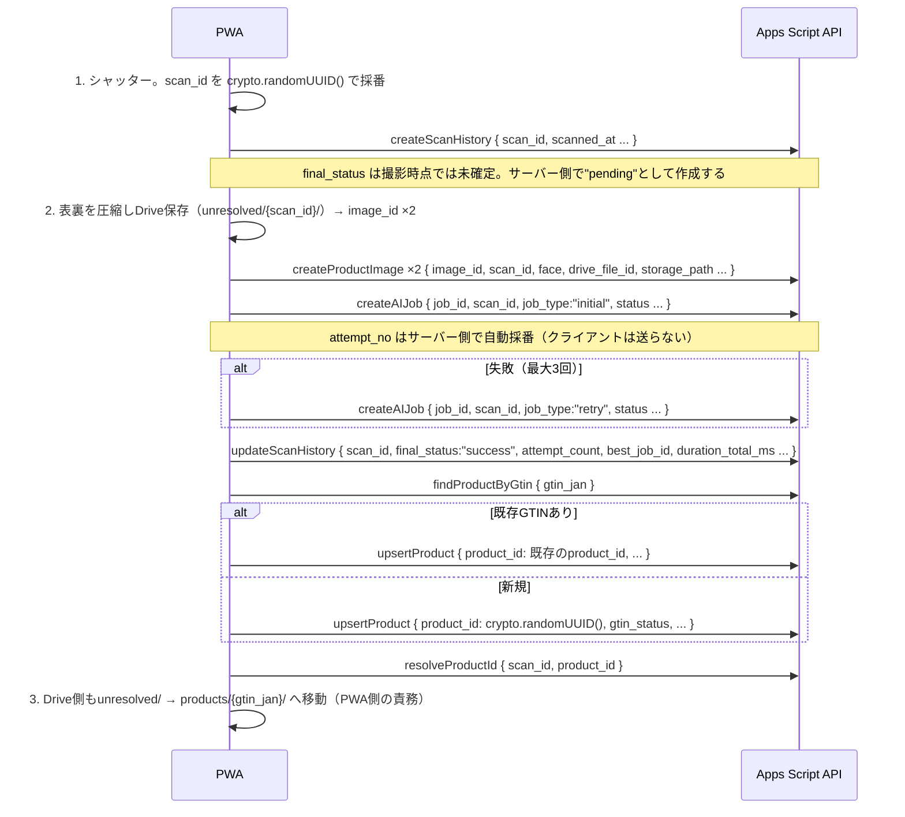

# Apps Script API 仕様（SH-02-S03）

由来: Notion `SH-02-S03｜Apps Script API作成`

PWAから画像URL・AI解析結果・商品マスターをGoogle Spreadsheetへ保存するための、
コンテナバインドApps ScriptのWeb App API。実装は
[apps-script/Code.gs](../apps-script/Code.gs)。

このAPIが読み書きするシート構成は [spreadsheet-columns.md](spreadsheet-columns.md)、
紐付けの順序（GTINは後から決まる）は
[product-images-and-ai-jobs.md](product-images-and-ai-jobs.md#紐付けの順序gtinは後から決まる)
を前提とする。

## デプロイ手順（`SH-02-S01` 完了後に実施）

1. `SH-02-S01` で作成したSpreadsheetを開き、拡張機能 → Apps Script でスクリプトエディタを開く。
2. [apps-script/Code.gs](../apps-script/Code.gs) と
   [apps-script/appsscript.json](../apps-script/appsscript.json) の内容をそのままコピーする
   （`appsscript.json` はエディタの「プロジェクトの設定」→「"appsscript.json"
   マニフェスト ファイルをエディタで表示する」を有効にすると編集できる）。
3. プロジェクトの設定 → スクリプト プロパティ で `API_KEY` と `SPREADSHEET_ID` の2つを追加する。
   - `API_KEY`: 自分で生成したランダムな文字列（例: `crypto.randomUUID()` をブラウザの
     コンソールで実行した結果）。**この値をNotion・GitHubには書かない**
     （[secrets-and-config.md](secrets-and-config.md)）。
   - `SPREADSHEET_ID`: このSpreadsheet自身のID（URLの `/d/` と `/edit` の間の文字列）。
     コンテナバインドスクリプトでも、Webアプリとして呼ばれた実行では
     `SpreadsheetApp.getActiveSpreadsheet()` が `null` を返しうるため、`Code.gs` は
     この値を `SpreadsheetApp.openById()` で明示的に開く（実装上の必須ルール、下記参照）。
4. デプロイ → 新しいデプロイ → 種類「ウェブアプリ」。
   - 実行するユーザー: **自分（デプロイする自分）**
   - アクセスできるユーザー: **全員**
     （匿名アクセス可だが、`API_KEY` を知らない限りどのアクションも失敗する。個人利用MVPの
     割り切り。詳細は [secrets-and-config.md](secrets-and-config.md)）
5. 発行されたWebアプリのURL（`https://script.google.com/macros/s/.../exec`）を控える。
   このURLと`API_KEY`は、PWA側の設定画面から入力してlocalStorageへ保存する
   （[secrets-and-config.md](secrets-and-config.md)、既存のGemini APIキーと同じ扱い）。
6. `Code.gs` を更新した場合は「新しいデプロイ」ではなく既存デプロイの「デプロイを管理」→
   鉛筆アイコンで**バージョンを更新**する（URLを変えないため）。

## 動作確認チェックリスト（`SH-02-S01` 完了・デプロイ後にHumanが実施）

このAPIは実際のSpreadsheet上でしか検証できないため、コードレビューだけでは完了扱いにしない。
`SH-02-S01` でのシート作成・上記デプロイ手順の完了後、以下を実機で確認する。

1. スクリプト プロパティに `API_KEY`・`SPREADSHEET_ID` が設定されていること。
2. Webアプリとしてデプロイが完了し、`{WEBAPP_URL}` へアクセスできること
   （`doGet` が `{ "success": true, "data": { "status": "ok", ... } }` を返す）。
3. `apiKey` を誤った値にしたリクエストが `unauthorized` で拒否されること。
4. `createScanHistory` / `createProductImage` / `createAIJob` / `findProductByGtin` /
   `upsertProduct` / `resolveProductId` / `updateScanHistory` の各アクションが、実際の
   `Products` / `ScanHistory` / `ProductImages` / `AIJobs` シートへ意図どおり反映されること
   （行の追加・べき等化・`attempt_no`の自動採番・`gtin_jan`等のプレーンテキスト書式を含む）。
5. `API_KEY` などの秘密値が、レスポンス・実行ログ・GitHub・Notionのいずれにも露出しないこと
   （[secrets-and-config.md](secrets-and-config.md)）。

## リクエスト形式

すべて `POST` 一本。`action` フィールドで操作を切り替える（Apps Script Web Appは
複数エンドポイントを持てないため）。

```
POST {WEBAPP_URL}
Content-Type: text/plain;charset=utf-8   ← Apps Script Web AppはCORS上この指定を推奨

{
  "apiKey": "（Script Propertiesに設定したAPI_KEY）",
  "action": "createScanHistory",
  "data": { ... }
}
```

> **Content-Typeについて**: `application/json` を指定すると、ブラウザがCORSプリフライト
> (`OPTIONS`) を送り、Apps ScriptはそれをGETとして扱ってしまい失敗する。PWA側は
> `Content-Type: text/plain;charset=utf-8` でJSON文字列を送ること（サーバー側は
> `e.postData.contents` をJSONとしてパースするので実害はない）。

## レスポンス形式

成功時:

```json
{ "success": true, "data": { ... } }
```

失敗時:

```json
{ "success": false, "error": { "code": "missing_fields", "message": "必須フィールドが不足しています: scan_id" } }
```

`code` の一覧: `bad_request` / `unauthorized` / `server_misconfigured` / `unknown_action` /
`missing_fields` / `sheet_not_found` / `sheet_not_initialized` / `unknown_column` /
`internal_error`。ユーザー向け表示への対応は
[secrets-and-config.md エラー時のユーザー表示](secrets-and-config.md#エラー時のユーザー表示)。

## クライアント側フロー（`action` の呼び出し順）

`product-images-and-ai-jobs.md` の「紐付けの順序」6ステップに対応する。



Drive上のファイル移動そのもの（`unresolved/{scan_id}/` → `products/{gtin_jan}/{scan_id}/`）は
このAPIの範囲外（Drive APIをPWAから直接叩くか、別アクションとして追加するかは未決定）。
`resolveProductId` はSpreadsheet側の3シートの `product_id` 列を更新するだけで、
`ProductImages.storage_path` の更新は呼び出し側が別途 `upsertProduct` 相当の更新か、
専用アクション追加が必要になる想定。**この境界は積み残しとする（下記）。**

## アクション一覧

### `createScanHistory`

| フィールド | 必須 | 備考 |
|---|---|---|
| `scan_id` | ✓ | クライアントでUUID採番 |
| `scanned_at` | ✓ | ISO 8601 |
| その他 `ScanHistory` の列名 | - | 撮影時点で判明していれば渡す（`final_status`・`attempt_count`等の
  「試行全体の結末」を表す列は通常まだ分からないため省略する） |

`created_at` は省略時サーバー側で現在時刻を補完する。`final_status` は省略時サーバー側で
`pending` を補完する（AI解析の結末が撮影時点では未確定のため）。既に同じ `scan_id` の行が
あれば新規行を追加せず既存の値をそのまま返す（べき等）。

### `updateScanHistory`

| フィールド | 必須 | 備考 |
|---|---|---|
| `scan_id` | ✓ | 対象行の特定に使う |
| `final_status` | - | `success`/`failed`/`aborted` に確定した時点で渡す |
| その他 `ScanHistory` の列名 | - | `attempt_count`・`best_job_id`・`duration_total_ms`・
  `gtin_jan`・`expiry_date`・`lot_number` 等、AI解析の試行が出揃った時点で判明した値を渡す |

AI解析（リトライ含む）が出揃った時点でPWAが1回呼ぶ。`resolveProductId` の
`product_id` 後追い更新と同じ仕組みで、既存の `ScanHistory` 行を `scan_id` で特定して
上書きする（新規行は作らない）。対象行が無ければ `{ updated: false, count: 0 }` を返す。

### `createProductImage`

| フィールド | 必須 | 備考 |
|---|---|---|
| `image_id` / `scan_id` / `face` / `drive_file_id` / `storage_path` / `captured_at` / `mime_type` | ✓ | |
| `label_status` | - | 省略時 `ai_only` |
| `is_training_candidate` | - | 省略時 `true` |

表裏で2回呼ぶ。同じ `image_id` で再送された場合は新規行を追加せず既存の値をそのまま返す
（べき等）。

### `createAIJob`

| フィールド | 必須 | 備考 |
|---|---|---|
| `job_id` / `scan_id` / `job_type` / `input_image_ids` / `ai_model` / `prompt_version` / `schema_version` / `status` / `started_at` | ✓ | |
| `attempt_no` | 送っても無視 | サーバー側で「同一scan_idの既存最大値+1」を自動採番する |
| `raw_response` | - | 50,000文字超は自動的に先頭で切り詰め、全文を `Scanhunt/logs/{job_id}.json` へ保存する |

リトライごと・再解析ごとに毎回呼ぶ（行は追記のみ、上書きしない）。同じ `job_id` で再送された
場合は新規行を追加せず、既存行の `attempt_no` をそのまま返す（べき等。ネットワークエラーで
応答を受け取れずPWAが再送しても `attempt_no` が飛ばない）。

### `findProductByGtin`

| フィールド | 必須 |
|---|---|
| `gtin_jan` | ✓ |

`{ found: boolean, product: {...} | null }` を返す。`record_status = merged` の行は
`found: false` として扱う（統合先を辿る処理は現状未実装。積み残し参照）。

### `upsertProduct`

| フィールド | 必須 | 備考 |
|---|---|---|
| `product_id` | ✓ | 新規なら `crypto.randomUUID()`、既存GTINなら `findProductByGtin` で得た値 |
| `gtin_status` | ✓ | `confirmed`/`unread`/`absent` |
| その他 `Products` の列名 | - | 90項目モデルのうちAIが抽出できた項目を渡す |

既存 `product_id` があれば更新（`revision` を+1）、無ければ新規作成する。

### `resolveProductId`

| フィールド | 必須 |
|---|---|
| `scan_id` | ✓ |
| `product_id` | ✓ |

`ScanHistory`（1行）・`ProductImages`（最大2行）・`AIJobs`（1行以上）の
`product_id` 列を一括更新する。

## 積み残し・要確認事項

1. **Drive移動（`unresolved/` → `products/{gtin}/`）の実行主体が未確定。**
   `product-images-and-ai-jobs.md` の積み残し#3のまま。PWAから直接Drive APIを呼ぶか、
   このApps Script APIへ `moveProductImages` 等のアクションを追加するかは、
   `SH-04-S01｜新規商品登録` の実装時に決める。
2. **`raw_response` を成功ジョブでも保存するかは未決着。** 現状は成功・失敗を問わず
   常に保存する実装（`product-images-and-ai-jobs.md` 積み残し#2と同じ未決着）。
3. **`getNextAttemptNo_` は毎回シート全走査する。** 行数が数千に達すると遅くなる見込み
   （`spreadsheet-columns.md` 積み残し#3）。MVPでは許容し、`SH-06-S01` 以降で計測する。
4. **同時リクエストの排他制御は未実装。** Apps Script Web Appは単一ユーザーのMVPを前提とし、
   `LockService` によるロックは入れていない。複数端末からの同時書き込みが始まる段階で検討する。
   （※ これは「同じ端末が同じリクエストを再送したときの重複」を防ぐべき等化とは別の課題。
   べき等化は `createScanHistory`/`createProductImage`/`createAIJob` に実装済み）。
