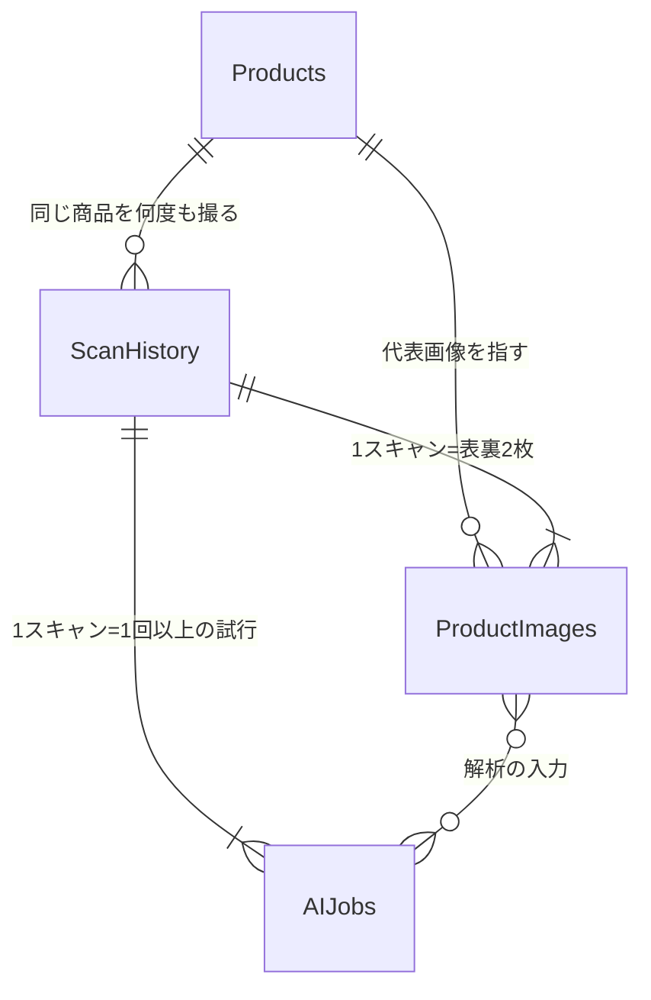

# ProductImages / AIJobs 設計

由来: Notion `SH-01-S02｜ProductImages / AIJobs設計`

## 設計サマリー

`Products`（GTIN単位の商品マスター）から、**画像証跡＝`ProductImages`**、
**AI解析実行ログ＝`AIJobs`**、**1回の撮影体験＝`ScanHistory`** を分離した。
分離の判断基準は「行が増える単位が違うもの同士は同じ表に置かない」こと。

| 表 | 1行が表すもの | 増え方 |
|---|---|---|
| `Products` | 商品1つ（GTIN単位） | 同じ商品を何度撮っても増えない（更新・リビジョン） |
| `ScanHistory` | ユーザーの撮影1回 | 撮るたびに増える |
| `ProductImages` | 画像1枚 | 1スキャンにつき2枚（表裏）増える |
| `AIJobs` | **AI解析の試行1回** | リトライ・再解析のたびに増える |

**`AIJobs` は「解析1件」ではなく「試行1回」を1行にする。** Go/No-Go検証で3回に1回の頻度で
失敗（無関係な生成・タイムアウト・主要フィールド欠落）が出ており、最大3回の自動リトライを
実装済み。試行単位で記録すれば、`SH-06-S04｜Prompt / モデル比較` の「処理時間・成功率・
抽出精度の比較」が `AIJobs` の GROUP BY だけで出せる。解析1件を1行にすると、失敗した試行が
消えて成功率が計算できなくなる。

この分離により、次の3用途が成立する。

- **再解析**（`SH-06-S03`）: `ProductImages` に Drive 上の原本が残るため、新しいモデル・Prompt で
  `job_type = reanalysis` のジョブを再実行できる。ユーザーに撮り直させない。
- **教師データ化**: `ProductImages.label_status` で「AI出力のみ」と「人が検証・修正済み」を
  区別する。修正済みのペア（画像＋正解JSON）だけを抽出できる。
- **品質改善**（`SH-06-S01`/`S04`）: `AIJobs` に `ai_model`・`prompt_version`・`duration_ms`・
  `status`・`raw_response` が残るため、モデル別・Prompt別の比較と、失敗パターンの事後分析ができる。

---

## ProductImages

撮影した画像1枚＝1行。**Drive上のファイル本体は消さない**（再解析と教師データ化の原資であるため）。

| 項目名（日本語） | field_name | 型 | 必須 | 説明・例 |
|---|---|---|---|---|
| 画像ID | `image_id` | string (UUID) | 必須 | 主キー |
| スキャンID | `scan_id` | string (UUID) | 必須 | `ScanHistory` への外部キー。表裏2枚が同じ値を持つ |
| 商品ID | `product_id` | string (UUID) | 任意 | `Products` への外部キー。**GTIN確定前は空。** 解析後に紐付ける |
| GTIN／JAN | `gtin_jan` | string | 任意 | 保存時点で判明していれば入れる。Drive再配置の判断に使う |
| 面 | `face` | enum (`front`/`back`) | 必須 | 表裏どちらか |
| DriveファイルID | `drive_file_id` | string | 必須 | Drive APIのファイルID。URLより安定するためこちらを正とする |
| Drive URL | `drive_url` | string (URL) | 任意 | 人が開く用。`Products.image_front_url` 等はこれを指す |
| 保存パス | `storage_path` | string | 必須 | 下記「Drive保存パスルール」に従う |
| 撮影日時 | `captured_at` | datetime (ISO 8601) | 必須 | 端末側のシャッター時刻 |
| 画像幅 | `width_px` | number | 任意 | 圧縮**後**の値（`SH-03-S01` で長辺1000〜1500pxへリサイズ） |
| 画像高さ | `height_px` | number | 任意 | 同上 |
| ファイルサイズ | `file_size_bytes` | number | 任意 | 圧縮後 |
| 圧縮前サイズ | `original_size_bytes` | number | 任意 | 圧縮効果ログ用。圧縮率＝この2列から算出 |
| MIMEタイプ | `mime_type` | string | 必須 | 例: `image/jpeg` |
| ラベル状態 | `label_status` | enum (`unlabeled`/`ai_only`/`human_verified`/`human_corrected`) | 必須 | 教師データ抽出のフィルタ。初期値 `ai_only` |
| 学習利用可否 | `is_training_candidate` | boolean | 必須 | 個人情報・誤撮影を除外する運用フラグ。初期値 `true` |
| 除外理由 | `exclusion_reason` | string | 任意 | `is_training_candidate = false` にした理由 |
| 作成日時 | `created_at` | datetime | 必須 | 行の作成時刻 |

### 面（face）を2値に固定した理由

コンセプト上「表と裏の2枚だけ」を守る（6方向撮影はユーザーがやらない）。ただし `face` を
enum にしておけば、将来 `side` や `nutrition_label`（栄養表示のクローズアップ）を追加しても
スキーマ変更なしで済む。**現時点で追加はしない。**

---

## AIJobs

Gemini API呼び出しの**試行1回**＝1行。成功・失敗を問わず必ず1行残す。

| 項目名（日本語） | field_name | 型 | 必須 | 説明・例 |
|---|---|---|---|---|
| ジョブID | `job_id` | string (UUID) | 必須 | 主キー |
| スキャンID | `scan_id` | string (UUID) | 必須 | `ScanHistory` への外部キー |
| 商品ID | `product_id` | string (UUID) | 任意 | 解析成功しGTINが確定した後に紐付ける |
| ジョブ種別 | `job_type` | enum (`initial`/`retry`/`reanalysis`/`backfill`) | 必須 | `retry`＝自動リトライ、`reanalysis`＝モデル更新後の再解析、`backfill`＝過去分の一括再処理 |
| 試行番号 | `attempt_no` | number | 必須 | 同一 `scan_id` 内で `job_type` をまたいで単調増加する通し番号（後述） |
| 入力画像ID | `input_image_ids` | array\<string\> | 必須 | `ProductImages.image_id` の配列。通常は表裏2件 |
| AIモデル | `ai_model` | string | 必須 | 例: `gemini-flash-latest`。**エイリアスではなく実際に呼んだ文字列を残す** |
| Promptバージョン | `prompt_version` | string | 必須 | 例: `p2.0` |
| Schemaバージョン | `schema_version` | string | 必須 | `responseSchema` の版。Promptと独立に変わりうるため別列 |
| 状態 | `status` | enum (`success`/`invalid_output`/`timeout`/`api_error`/`aborted`) | 必須 | 下記「失敗の分類」参照 |
| 開始日時 | `started_at` | datetime | 必須 | API呼び出し直前 |
| 終了日時 | `finished_at` | datetime | 任意 | 応答受領またはタイムアウト時 |
| 所要時間 | `duration_ms` | number | 任意 | 圧縮による短縮効果の計測に使う |
| 入力トークン数 | `input_tokens` | number | 任意 | 取得できる場合のみ。コスト試算用 |
| 出力トークン数 | `output_tokens` | number | 任意 | 同上 |
| 生応答 | `raw_response` | string (JSON) | 任意 | **失敗時の事後分析の要。** 長大なためセル上限に注意 |
| 抽出結果 | `extracted_json` | string (JSON) | 任意 | 検証を通った構造化データ。`Products` 更新の入力 |
| エラー内容 | `error_message` | string | 任意 | 例外・HTTPステータス・検証NG理由 |
| 検証NG項目 | `validation_failures` | array\<string\> | 任意 | 例: `["cooking_instructions", "nutrition"]`。主要フィールド欠落の内訳 |
| 作成日時 | `created_at` | datetime | 必須 | |

### `attempt_no` の採番規則

**`job_type` をまたいでリセットしない。** 初回解析時点では `scan_id` 内で1から始まる連番だが、
後から同じ `scan_id` へ再解析（`reanalysis`）やバックフィル（`backfill`）を実行しても、
番号は1へ戻さず前回の最大値+1から続ける。

- 初回スキャン: `job_type=initial` を `attempt_no=1` で作り、失敗ならリトライを
  `attempt_no=2`・`3` と増やす（最大3回）。
- 後日の再解析: その `scan_id` に対する既存の `AIJobs` 行の `attempt_no` 最大値を読み、
  `+1` から採番する（例: 初回が1〜3まで使っていれば `reanalysis` は4から始まる）。
- こうすることで `(scan_id, attempt_no)` の組が常に一意になり、初回とその後の再解析・
  バックフィルの試行を取り違えずに突き合わせられる。新しい列（run_id等）は増やさない。

**成功率の分母には `attempt_no` の値ではなく `job_type` 列を使う。** 「3回に1回失敗する」
という初回解析の成功率は `job_type IN ('initial', 'retry')` で絞り込んだ行から計算する。
`attempt_no` が4以上でも `job_type=retry` であればその範囲に含む。`reanalysis`・`backfill`は
別集計（モデル比較 `SH-06-S04` 側）に使う。

### 失敗の分類（`status`）

Go/No-Go検証で観測した3種の失敗を、対処が違うので分けて持つ。まとめて `error` にすると
「Promptを直すべきか、タイムアウトを延ばすべきか」が事後に判別できない。

| status | 意味 | 想定する対処 |
|---|---|---|
| `success` | JSONパース成功かつ主要フィールド検証を通過 | — |
| `invalid_output` | パース失敗、または無関係な内容の生成、主要フィールド欠落 | Prompt・Schemaの改善（`SH-03-S03`） |
| `timeout` | 25秒のタイムアウト到達 | 画像圧縮（`SH-03-S01`）、タイムアウト値の見直し |
| `api_error` | HTTPエラー、キー不正、レート制限 | 環境・キー管理（`SH-02-S04`） |
| `aborted` | ユーザー操作・画面遷移による中断 | 成功率の計算から除外する |

**`aborted` は成功率の分母に入れない。** 既存実装は `scanGeneration`・`cameraGeneration` で
古い解析を破棄しており、これを失敗として数えると精度指標が実態より悪く出る。

---

## Products とのキー連携



### 紐付けの順序（GTINは後から決まる）

撮影時点ではGTINが分からない。**`product_id` を採番してから撮るのではなく、撮影・保存を
先に済ませ、解析成功後に紐付ける。** 撮影が失敗解析に巻き込まれて消えるのを防ぐため。

1. シャッター → `scan_id` を採番し `ScanHistory` を1行作る（`product_id` は空）
2. 表裏2枚を圧縮 → Driveへ保存 → `ProductImages` を2行作る（`product_id` は空、
   `storage_path` は暫定領域）
3. `AIJobs` を `attempt_no = 1` で作り、Geminiを呼ぶ
4. 失敗なら `attempt_no` を増やして3まで再試行（行は毎回増やす）
5. 成功 → `gtin_jan` が取れる → `Products` を検索
   - 既存GTINあり: その `product_id` を採用（`SH-04-S02` のGTIN重複判定）
   - なし: `product_id` を採番して `Products` へ新規登録（`SH-04-S01`）
6. `ScanHistory`・`ProductImages`・`AIJobs` の `product_id` を確定値で更新し、
   画像をGTIN配下へ移動

### GTINが最後まで取れなかった場合

`invalid_output` が3回続く、またはバーコードが読めない商品では `gtin_jan` が空のまま終わる。
このとき **`product_id` は採番する**（`Products` に「GTIN不明」の行を作る）。理由は2つ。

- 90項目モデルで `product_id` を主キー、`gtin_jan` を必須としつつ別項目にしたのは、まさに
  このケースのため（輸入食材でJANが無い・読めない）。
- 画像を未解決領域に置きっぱなしにすると、再解析の対象を機械的に拾えなくなる。

`Products` 側に `gtin_status`（`confirmed`/`unread`/`absent`）を持たせ、後からGTINが判明した
ときにマージできるようにする。

---

## Drive保存パスルール

```
/Scanhunt/
  products/
    {gtin_jan}/                    ← GTIN確定後
      {scan_id}/
        front.jpg
        back.jpg
  unresolved/
    {scan_id}/                     ← GTIN未確定・解析失敗
      front.jpg
      back.jpg
```

### 規則

- **フォルダのキーはGTIN、その下がスキャン単位。** GTIN単位にまとめる理由は、同一商品の
  複数回スキャンを1箇所で見られるようにするため（パッケージ改訂の比較、再解析対象の一括取得）。
- ファイル名は `front.jpg`／`back.jpg` 固定。時刻は親フォルダの `scan_id` と
  `ProductImages.captured_at` が持つため、ファイル名には入れない。
- 解析成功でGTIN確定時に `unresolved/{scan_id}/` から `products/{gtin_jan}/{scan_id}/` へ**移動**する。
  移動後は `ProductImages.storage_path` を更新する。`drive_file_id` は移動しても変わらないため、
  **参照の正はパスではなく `drive_file_id`** とする。
- GTIN不明のまま確定した場合は `unresolved/` に残す。後からGTINが判明したら移動する。
- 拡張子は圧縮後形式に合わせて `.jpg` 固定（JPEG品質70〜80%）。

### 消さないもの・消すもの

- **画像本体は自動削除しない。** 再解析と教師データの原資。容量が問題になった時点で
  `is_training_candidate = false` かつ `label_status = ai_only` のものから検討する
  （現時点では削除ポリシーを作らない）。
- `AIJobs.raw_response` はSpreadsheetのセル上限（50,000文字）に当たりうる。
  **上限を超える場合は先頭N文字＋Driveへの全文保存**とし、`raw_response` には切り詰めた旨を残す
  （`raw_response_truncated` 列。[spreadsheet-columns.md](spreadsheet-columns.md)）。
  全文の置き場は `/Scanhunt/logs/{job_id}.json`。

---

## 積み残し・要確認事項

1. **`ScanHistory` の列定義** — **→ `SH-01-S04` で確定**
   （[spreadsheet-columns.md](spreadsheet-columns.md)）。個体固有フィールドは `ScanHistory` へ置いた。
2. **`raw_response` の保存を全ジョブで行うか。** 成功ジョブの生応答まで残すとSpreadsheetが
   急速に肥大する。「失敗時のみ全文、成功時は `extracted_json` のみ」を推奨するが、
   `SH-06-S04` のモデル比較で成功時の生応答が要るかは未確定。**未決着。**
3. **Drive移動のタイミング**。解析成功のたびに移動すると、Apps Script実行時間とAPIクォータを
   消費する。スキャン直後に同期移動するか、バッチで後追いするかは `SH-02-S03` の実装時に決める。
4. **同時スキャンの `attempt_no` 競合**。単一ユーザーのMVPでは問題にならないが、複数端末から
   同時に書く段階になれば採番をサーバー側（Apps Script）に寄せる必要がある。
