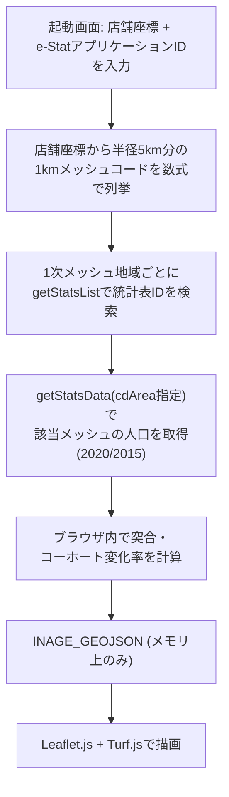

# 未来の店舗生存サバイバルゲーム — Design Doc（実装ベース・改訂版 v2）

> **改訂の経緯**: 本書は当初 `store-survival-simulator-spec.md`（インセプションデッキ＆PRD）を
> ベースに、SpatiaLite + FastAPI + MapLibre/D3.js という技術スタックを前提とした実装設計書
> だった。実装は`store-survival-game-gdd-v6.md`（GDD v6.1）が示す「円建て財務モデルを持たない
> 定性診断」という方向性は踏襲しつつ、**バックエンド・DBを一切持たない単一HTML構成**に
> 落ち着いた。データの扱いは2段階で変遷している。
>
> 1. まず千葉市稲毛区限定で、実際の町丁目境界shapefileをHTMLに静的同梱し、人口統計
>    （小地域集計）だけを参加者のe-Stat APIキーでライブ取得するハイブリッド方式にした。
> 2. その後「研修本番は全国が対象」という要件を受け、町丁目境界（自治体固有・全国分を
>    同梱するのは非現実的）を捨て、**JIS地域メッシュ統計（1kmメッシュ、境界は数式で
>    計算できる）**に全面移行した。これにより境界データの同梱・ライブ取得のどちらも
>    不要になり、真の全国対応を実現している。
>
> 本書はこの最新（v2, メッシュベース・全国対応）の実装を記述する。経緯の詳細は
> `README.md` を参照。

---

## 1. アーキテクチャ概要



サーバー・データベースは存在しない。`index.html` はローカルファイルとして開くだけで
動作する。起動画面で**店舗座標**と**自分自身のe-Stat アプリケーションID（APIキー）**を
入力すると、ブラウザがそのキーを使って直接 `api.e-stat.go.jp` にfetchし、地域メッシュ統計を
その場で取得する。キーはJS変数として保持されるのみで、`localStorage`等への永続化や配布
ファイルへの埋め込みは行わない。取得したデータもページを閉じれば消える（キャッシュしない）。

境界ポリゴン（地図の形状データ）は**一切fetchしない**。JIS地域メッシュは緯度経度から
数式で座標が一意に決まるグリッドであり、町丁目のような実際の行政区画ポリゴンを取得する
必要がないため。これにより「全国のどの座標でも動く」ことと「境界データのCORS問題を
回避する」ことを同時に達成している。

> ✅ **CORS実機検証済み（2026-07-26、Chrome、`file://`で開いた状態）**:
> - `api.e-stat.go.jp/rest/3.0/app/json/getStatsList` / `getStatsData` … ブラウザから
>   正常にfetchできることを確認（実際のappIdでレスポンスが返る）。
> - `www.e-stat.go.jp/gis/statmap-search/data`（旧・町丁目境界shapefileの配信元） …
>   CORSで確実にブロックされる（`No 'Access-Control-Allow-Origin' header is present`）。
>   これが「境界ポリゴンを一切使わないメッシュベース設計」に切り替えた直接の理由。

---

## 2. JIS地域メッシュ座標計算（境界データ不要の要）

1kmメッシュ（3次メッシュ、8桁）の座標は、緯度・経度から以下の式で一意に決まる
（`index.html` 内 `meshCodeAt()` / `meshBBoxFromCode()`）。東京駅の実際の
公開メッシュコード「53394611」と一致することを確認済み。

```
p = floor(lat × 1.5)                     // 1次メッシュ(緯度, 2桁)
u = floor(lng − 100)                     // 1次メッシュ(経度, 2桁)
q, r = 緯度の残差を 5分・30秒 単位で分解  // 2次・3次メッシュ(緯度)
v, w = 経度の残差を 7.5分・45秒 単位で分解 // 2次・3次メッシュ(経度)
meshCode = p(2桁) + u(2桁) + q(1桁) + v(1桁) + r(1桁) + w(1桁)
```

逆変換（`meshBBoxFromCode()`）でメッシュコードから四隅の緯度経度を計算し、そのまま
Leafletの矩形ポリゴンとして描画する。店舗座標から半径Dkm分のbboxをカバーする全メッシュを
列挙する`meshCodesInBBox()`は、緯度15秒・経度22.5秒間隔の一様グリッドを走査するだけで
（1kmメッシュの場合は緯度30秒・経度45秒間隔）、抜け漏れなく求まる。

---

## 3. データ取得ロジック（`index.html` 内、`loadRealData()`）

### 3.1 地域メッシュ統計特有の癖

町丁目統計（小地域集計）と異なり、地域メッシュ統計には次の2つの癖があり、
実装上の主要な複雑さの原因になっている。

1. **統計表IDが1次メッシュ地域ごとに別々**: 例えば「M3622」という1次メッシュ地域
   （約80km四方）だけで1つの統計表になっており、日本全国で数百〜千以上の統計表が
   存在する。固定の`statsDataId`を1つ埋め込む方式は使えず、店舗座標が属する1次
   メッシュコード（`region1()`、meshCodeの先頭4桁）を求めた上で、`getStatsList`
   （`searchWord`に年度と地域コードを含め、`searchKind=2`必須）を都度呼んで
   実際の`statsDataId`を検索する（`findMeshTableId()`）。
2. **年齢区分のcat01コードが年度によってズレる**: 実機検証の結果、2020年版は
   「18歳以上」という区分が追加されたため、それ以降の全区分のコード番号が
   2015年版から1つずつシフトしていた（例:「65歳以上」が2015年`0160`→2020年
   `0190`）。したがってコード番号をハードコードせず、分類名の部分一致
   （`findCat01Code()`、「０～１４歳」「１５～６４歳」「６５歳以上」を検索、
   全角文字での完全一致部分文字列を使用）で該当コードを毎回特定する。
   「人口総数」だけはコード`0010`が両年度で安定していたため固定値として扱う。

### 3.2 処理の流れ

対象メッシュは店舗座標を中心に半径5,000m（UIスライダーの最大値）をカバーする範囲を
ゲーム開始時に一括で先読みする（`MAX_RADIUS_M`）。以降のスライダー操作・業種変更は
再fetchせず、先読み済みデータをTurf.jsで絞り込むだけ。

1. `meshCodesInBBox()`で対象メッシュコード一覧を計算。
2. `fetchYearData("令和2年", meshCodes)` / `fetchYearData("平成27年", meshCodes)`を
   それぞれ呼ぶ。内部では1次メッシュ地域ごとにグループ化し、地域ごとに
   `findMeshTableId()`→`fetchMeshValues()`を実行。
3. `fetchMeshValues()`は`cdArea`パラメータ（対象メッシュコードのカンマ区切り）で
   絞り込んだ`getStatsData`を呼ぶ。1次メッシュ地域全体は数万件になり得るため、
   必ず`cdArea`で絞り込み、かつ50件ずつバッチ処理する。
4. `cat02`（秘匿・合算フラグ）が`"1"`（無し）の行のみ採用し、秘匿(`"3"`)・
   合算(`"2"`)は除外する。
5. 2015年・2020年の値から町丁目統計版と同じ式でメッシュごとの年率を計算:
   $$\text{rate}_b = \left(\frac{\text{Pop}_{2020}(b)}{\text{Pop}_{2015}(b)}\right)^{1/5} - 1$$
6. 2015年データが無い（非居住・秘匿等の）メッシュは、先読み範囲内の人口加重平均
   （フォールバック）で補完する。
7. 各メッシュコードについて`meshBBoxFromCode()`でジオメトリを計算し、`INAGE_GEOJSON`
   （メモリ上のグローバル変数）を組み立てる。

各`getStatsList`/`getStatsData`呼び出しは`try/catch`で失敗を捕捉し、起動画面に
「取得に失敗しました: (理由)」を表示して再試行できるようにする。DBスキーマは存在せず、
メッシュ1件＝GeoJSON Feature 1件がそのまま最終データ。

---

## 4. フロントエンドUI（`index.html`）

単一のHTMLファイルで、外部依存はCDN経由の **Leaflet.js 1.9.4** と **Turf.js 6** のみ
（MapLibre/D3.js、Streamlit/PyDeck、shpjsのいずれも不使用）。

### 4.1 起動画面（`#setupScreen`）
ゲームタイトル・概要説明、**店舗の場所**（Google MapsのURL、または「緯度, 経度」を
既存の`parseLatLngFromText()`で解析）、**e-Stat APIキー入力欄**（`type=password`、
表示/隠すトグル付き）、開始ボタンで構成される。開始ボタン押下で`loadRealData(appId,
lat, lng)`が完了すると`#setupScreen`を隠し、`#gameRoot`（地図・診断UI一式）を表示、
`map.setView(storeLatLng, 14)`で店舗周辺にビューを移動する
（`rerenderAll()`はこの成功後にのみ呼ばれ、データ未取得の間は空振りするようガードしてある）。

### 4.2 商圏抽出
店舗位置（クリック／ドラッグ／起動画面での座標指定）を中心に、業種ごとの
`radiusDefault`（500m〜3000m）を半径として、Turf.jsでメッシュ矩形との交差判定を行い、
商圏内フィーチャー集合を得る。半径スライダーの最大値（5,000m）分は起動時に先読み済み
なので、業種変更・半径調整は再fetch不要。

### 4.3 業種定義（`BUSINESS_TYPES`）
GDD v6.1の7業種（コンビニ／食品スーパー／居酒屋／ドラッグストア／ペットショップ・
サロン／ペット関連小売／金融事業・地域代理店）に加え、**⑧ホームセンター**を実装後に
追加した（GDD文書には無い、実装時点での追加業種）。各業種は`weights`（年少/生産年齢/
老年の客層適性重み）、`laborDependency`（依存する労働力層）、`wasteRiskCoef`
（商品ミスマッチ感度）、`radiusDefault` を持つ。**円建ての初期売上・原価率・人件費率は
GDD文書上「参考値」として残っているだけで、コードには一切存在しない。**

> **年齢区分の簡素化について**: 地域メッシュ統計は「年少(0-14)・生産年齢(15-64)・
> 老年(65+)」の3区分のみで、町丁目統計版が使っていた5歳階級別の細かい区分
> （15-24歳の「若年労働力」等）は表現できない。`laborDependency:"young"`
> （コンビニ・居酒屋等が本来「10代後半〜20代前半のアルバイト」を想定していた区分）は、
> 0-14歳人口を労働力とみなす誤りを避けるため、生産年齢人口(15-64歳)全体を労働力
> プールとみなす扱いに変更した（`laborPoolAt()`）。これにより`housewife_senior`
> 区分との差は「係数(`HOUSEWIFE_FRACTION`)を掛けるかどうか」のみになっている。

### 4.4 戦略適合度診断（`evaluateStrategy()`）
実人口データのみを使い、円換算は行わない。

* **客層マッチ度**: 業種の重み × 商圏内実人口（年少/生産年齢/老年の3区分）を
  現在・10年後で比較した比率。
* **採用のしやすさ**: 依存する労働力層の人口が10年でどう変わるかの比率
  （`laborPoolAt()`。ヒトコマンド「主婦・シニア短時間シフト」適用時は労働力プールの
  定義を切り替える）。
* **商品ミスマッチ判定**: 高齢化率30%超 かつ 業種が若年/現役寄りの場合にフラグを立てる
  （モノコマンドで解消可能）。
* **判定は3段階**: `ratio >= 1.0` → 良好、`>= 0.8` → 注意、それ未満 → 深刻
  （GDD v6.1の本文が挙げる4段階・閾値1.1/0.9/0.7とは異なる、実装上の簡易版）。

**カネ（財務）コマンドは実装されていない**（GDD v6.1の「一旦削除」方針をそのまま反映）。

### 4.5 未実装のGDD要素
以下はGDD v6が描いていたが、本アプリには実装されていない:
* Streamlit + PyDeckによる3D描画
* 10期（10年間）のP&L推移シミュレーション
* SSS〜Eの生存ランク判定
* ポータブルZIP配布（`起動する.bat` / `run.sh`）

（メッシュ座標計算・SpatiaLite不使用という点は、結果的にGDD v6が最初に提案していた
方向性と一致している。詳細は`README.md`の経緯を参照。）

---

## 5. 対応範囲・制約

* 日本全国の座標に対応（メッシュ座標計算に地域制限はない）。ただし地域メッシュ統計
  自体が存在しない座標（海上、統計非公表エリア等）では診断できない。
* ゲーム開始時に半径5,000m（`MAX_RADIUS_M`）分を先読みする。開始後に店舗位置を
  その範囲外まで動かした場合（地図クリック・マーカードラッグ・Google Maps URL貼付の
  いずれでも）、`setStoreLocation()`が自動的にその新しい場所のメッシュ統計を
  `loadRealData()`で取り直す（別の店舗・別のエリアを続けて見たい、という利用実態に
  合わせた挙動）。取得中は多重実行を防ぐガード（`locationFetchInFlight`）を入れている。
* 1次メッシュの境界付近に店舗がある場合、複数の1次メッシュ地域にまたがってデータを
  取得する（`fetchYearData()`が地域ごとにグループ化して個別に処理するため、動作は
  するが取得回数が増える）。
* 人口統計データはページ滞在中のみメモリに保持され、リロードすると再取得が必要
  （オフライン再開・キャッシュの仕組みはない）。
* APIキーの検証はe-Stat側のエラーレスポンス（`RESULT.STATUS`）任せで、事前の
  フォーマットチェック等は行っていない。
* 年齢区分が3区分（0-14/15-64/65+）に粗くなったことで、業種の労働力・客層プロファイル
  （`BUSINESS_TYPES`の重み）は町丁目統計版で調整されていた値をそのまま流用している。
  3区分に合わせた精緻化はされていない（4.3節参照）。

## 6. 未解決事項（Open Questions）

* `getStatsList`の`searchWord`検索がタイトル文字列の部分一致に依存しているため、
  将来e-Stat側で統計表のタイトル表記が変わると`findMeshTableId()`が該当表を
  見つけられなくなるリスクがある（フォールバックとして`statsCode=00200521`固定と
  地域メッシュコードの完全一致優先ロジックを入れているが、根本的な保証ではない）。
* `cat01`のコード番号が年度によってズレる問題は名前ベース検索で吸収しているが、
  分類名の文言自体が将来変わった場合はやはり壊れる。定期的な実データ確認が必要。
* 研修中に多数の参加者が同時に`getStatsList`/`getStatsData`を叩くことによる、
  e-Stat側のレート制限・負荷への配慮は未検討。
* `BUSINESS_TYPES`の重み・労働力プロファイルを、3区分（年少/生産年齢/老年）に
  合わせて再チューニングするかどうかは未定（現状は町丁目統計版の値を流用）。
* GDD v6.1が言及する「実データ化された場合の財務シミュレーション復活」を実装するか
  どうかは未定。
