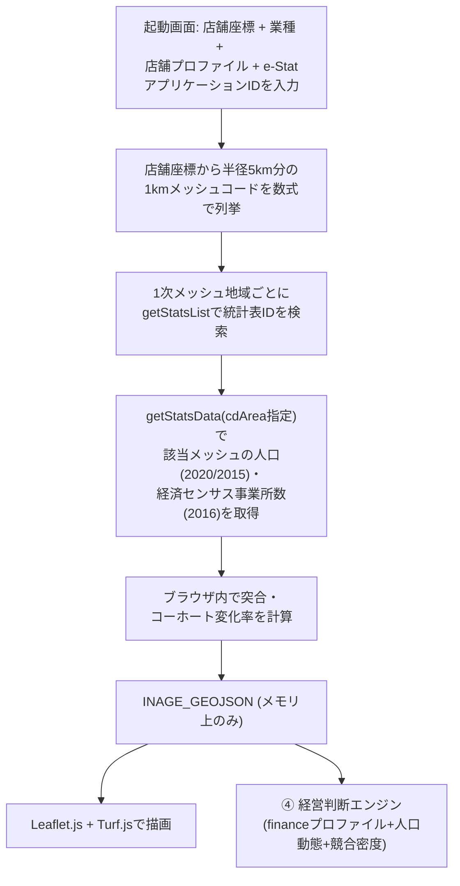

# 未来の店舗生存サバイバルゲーム — Design Doc（実装ベース・改訂版 v3、v0.7.0時点）

> **改訂の経緯**: 本書は当初 `store-survival-simulator-spec.md`（インセプションデッキ＆PRD）を
> ベースに、SpatiaLite + FastAPI + MapLibre/D3.js という技術スタックを前提とした実装設計書
> だった。実装は`store-survival-game-gdd-v6.md`（GDD v6.1）が示す「円建て財務モデルを持たない
> 定性診断」という方向性は踏襲しつつ、**バックエンド・DBを一切持たない単一HTML構成**に
> 落ち着いた。データの扱いは2段階で変遷している。
>
> 1. まず千葉市稲毛区限定で、実際の町丁目境界shapefileをHTMLに静的同梱し、人口統計
>    （小地域集計）だけを参加者のe-Stat APIキーでライブ取得するハイブリッド方式にした。
> 2. その後「研修本番は全国が対象」という要件を受け、町丁目境界（自治体固有・全国分を
>    同梱するのは非現実的）を捨て、**JIS地域メッシュ統計（1kmメッシュ、境界は数式で
>    計算できる）**に全面移行した。これにより境界データの同梱・ライブ取得のどちらも
>    不要になり、真の全国対応を実現している。
>
> **v2からv3への主な変更点（v0.2.0〜v0.7.0）**: 「出店候補地を評価するツール」から
> 「既に営業中の店舗を、実際の財務・築年数・従業員構成を踏まえて経営判断する」ツールへと
> 前提が変わった。具体的には、店舗プロファイル（財務・従業員・築年数）の入力、経済センサス
> による競合密度の概算連携、5択の経営判断（保全/改装/商圏拡大/競合対応/撤退）の妥当性診断、
> 財務健全性を定性的に動かす「カネ」コマンドが新たに加わった。GDD v6.1が「一旦削除」と
> していたカネの要素は、円建てP&Lとしてではなく「tierを1段階動かす定性的なコマンド」という
> 形で復活している（4.6節参照）。本書はこの最新（v0.7.0）の実装を記述する。経緯の詳細は
> `README.md` を参照。

---

## 1. アーキテクチャ概要



サーバー・データベースは存在しない。`index.html` はローカルファイルとして開くだけで
動作する。起動画面で**店舗座標**・**業種**・**店舗プロファイル（財務・従業員・築年数）**・
**自分自身のe-Stat アプリケーションID（APIキー）**を入力すると、ブラウザがそのキーを
使って直接 `api.e-stat.go.jp` にfetchし、地域メッシュ統計（人口・経済センサス双方）を
その場で取得する。キーはJS変数として保持されるのみで、`localStorage`等への永続化や配布
ファイルへの埋め込みは行わない。取得したデータもページを閉じれば消える（キャッシュしない）。

境界ポリゴン（地図の形状データ）は**一切fetchしない**。JIS地域メッシュは緯度経度から
数式で座標が一意に決まるグリッドであり、町丁目のような実際の行政区画ポリゴンを取得する
必要がないため。これにより「全国のどの座標でも動く」ことと「境界データのCORS問題を
回避する」ことを同時に達成している。

> ✅ **CORS実機検証済み（2026-07-26、Chrome、`file://`で開いた状態）**:
> - `api.e-stat.go.jp/rest/3.0/app/json/getStatsList` / `getStatsData` … ブラウザから
>   正常にfetchできることを確認（実際のappIdでレスポンスが返る）。
> - `www.e-stat.go.jp/gis/statmap-search/data`（旧・町丁目境界shapefileの配信元） …
>   CORSで確実にブロックされる（`No 'Access-Control-Allow-Origin' header is present`）。
>   これが「境界ポリゴンを一切使わないメッシュベース設計」に切り替えた直接の理由。

---

## 2. JIS地域メッシュ座標計算（境界データ不要の要）

1kmメッシュ（3次メッシュ、8桁）の座標は、緯度・経度から以下の式で一意に決まる
（`index.html` 内 `meshCodeAt()` / `meshBBoxFromCode()`）。東京駅の実際の
公開メッシュコード「53394611」と一致することを確認済み。

```
p = floor(lat × 1.5)                     // 1次メッシュ(緯度, 2桁)
u = floor(lng − 100)                     // 1次メッシュ(経度, 2桁)
q, r = 緯度の残差を 5分・30秒 単位で分解  // 2次・3次メッシュ(緯度)
v, w = 経度の残差を 7.5分・45秒 単位で分解 // 2次・3次メッシュ(経度)
meshCode = p(2桁) + u(2桁) + q(1桁) + v(1桁) + r(1桁) + w(1桁)
```

逆変換（`meshBBoxFromCode()`）でメッシュコードから四隅の緯度経度を計算し、そのまま
Leafletの矩形ポリゴンとして描画する。店舗座標から半径Dkm分のbboxをカバーする全メッシュを
列挙する`meshCodesInBBox()`は、緯度15秒・経度22.5秒間隔の一様グリッドを走査するだけで
（1kmメッシュの場合は緯度30秒・経度45秒間隔）、抜け漏れなく求まる。

人口統計（国勢調査）と経済センサス（事業所統計）はどちらも同じ8桁の1kmメッシュコードで
提供されており、地域メッシュ間の座標変換・粒度調整は一切不要（実機検証で確認済み、
3.3節参照）。

---

## 3. データ取得ロジック（`index.html` 内、`loadRealData()`）

### 3.1 地域メッシュ統計特有の癖（国勢調査）

町丁目統計（小地域集計）と異なり、地域メッシュ統計には次の2つの癖があり、
実装上の主要な複雑さの原因になっている。

1. **統計表IDが1次メッシュ地域ごとに別々**: 例えば「M3622」という1次メッシュ地域
   （約80km四方）だけで1つの統計表になっており、日本全国で数百〜千以上の統計表が
   存在する。固定の`statsDataId`を1つ埋め込む方式は使えず、店舗座標が属する1次
   メッシュコード（`region1()`、meshCodeの先頭4桁）を求めた上で、`getStatsList`
   （`searchWord`に年度と地域コードを含め、`searchKind=2`必須）を都度呼んで
   実際の`statsDataId`を検索する（`findMeshTableId()`）。
2. **年齢区分のcat01コードが年度によってズレる**: 実機検証の結果、2020年版は
   「18歳以上」という区分が追加されたため、それ以降の全区分のコード番号が
   2015年版から1つずつシフトしていた（例:「65歳以上」が2015年`0160`→2020年
   `0190`）。したがってコード番号をハードコードせず、分類名の部分一致
   （`findCat01Code()`、「０～１４歳」「１５～６４歳」「６５歳以上」を検索、
   全角文字での完全一致部分文字列を使用）で該当コードを毎回特定する。
   「人口総数」だけはコード`0010`が両年度で安定していたため固定値として扱う。

### 3.2 国勢調査データ取得の流れ

対象メッシュは店舗座標を中心に半径5,000m（UIスライダーの最大値）をカバーする範囲を
ゲーム開始時に一括で先読みする（`MAX_RADIUS_M`）。以降のスライダー操作・業種変更は
再fetchせず、先読み済みデータをTurf.jsで絞り込むだけ。

1. `meshCodesInBBox()`で対象メッシュコード一覧を計算。
2. `fetchYearData("令和2年", meshCodes)` / `fetchYearData("平成27年", meshCodes)`を
   それぞれ呼ぶ。内部では1次メッシュ地域ごとにグループ化し、地域ごとに
   `findMeshTableId()`→`fetchMeshValues()`を実行。
3. `fetchMeshValues()`は`cdArea`パラメータ（対象メッシュコードのカンマ区切り）で
   絞り込んだ`getStatsData`を呼ぶ。1次メッシュ地域全体は数万件になり得るため、
   必ず`cdArea`で絞り込み、かつ50件ずつバッチ処理する。
4. `cat02`（秘匿・合算フラグ）が`"1"`（無し）の行のみ採用し、秘匿(`"3"`)・
   合算(`"2"`)は除外する。
5. 2015年・2020年の値から町丁目統計版と同じ式でメッシュごとの年率を計算:
   $$\text{rate}_b = \left(\frac{\text{Pop}_{2020}(b)}{\text{Pop}_{2015}(b)}\right)^{1/5} - 1$$
6. 2015年データが無い（非居住・秘匿等の）メッシュは、先読み範囲内の人口加重平均
   （フォールバック）で補完する。
7. 各メッシュコードについて`meshBBoxFromCode()`でジオメトリを計算し、`INAGE_GEOJSON`
   （メモリ上のグローバル変数）を組み立てる。

各`getStatsList`/`getStatsData`呼び出しは`try/catch`で失敗を捕捉し、起動画面に
「取得に失敗しました: (理由)」を表示して再試行できるようにする。DBスキーマは存在せず、
メッシュ1件＝GeoJSON Feature 1件がそのまま最終データ。

### 3.3 経済センサス（競合密度）データ取得（v0.4.0で追加）

④の経営判断のうち「競合を叩く」の妥当性判定に使う、商圏内の競合密度の概算値を、
国勢調査と同じ1kmメッシュ単位で追加取得する。**実機で検証済みの事実**（後から仮定で
実装したものではない）:

* 政府統計コードは`statsCode: "00200553"`（経済センサス‐活動調査）。検索語は
  `"経済センサス-活動調査 M" + 1次メッシュコード`（年を含めない — 年を含めると
  ヒットしない）。同じ検索語で複数年度の統計表が混在して返るため、タイトルに
  「産業（大分類）別」を含み、かつ`SURVEY_DATE`が最も新しいものを選ぶ
  （`findEconMeshTableId()`）。
* **令和3年（2021年、最新の経済センサス）のメッシュ統計は存在しない**（複数の検索語で
  確認済み）。取得できる最新は**平成28年（2016年）**の「産業（大分類）別事業所数」で、
  これは人口データ（2020年）よりさらに6年古い。
* 業種区分は**大分類のみ**（中分類・小分類の「小売業のうちコンビニだけ」等の細分は
  取得できない）。実際に使っているcat01コード:
  - `100`: 卸売業，小売業（コンビニ・スーパー・ドラッグストア・ペット小売・
    ホームセンターの代理指標として使用）
  - `110`: 金融業，保険業（金融事業・地域代理店の代理指標）
  - `140`: 宿泊業，飲食サービス業（居酒屋の代理指標）
  - `150`: 生活関連サービス業，娯楽業（ペットショップ・サロンの代理指標）
  各`BUSINESS_TYPES`エントリの`econCode`フィールドでこの対応を持つ。
* メッシュコードの粒度は国勢調査と同じ8桁（1kmメッシュ）で、変換・調整は不要
  （9桁の500mサブメッシュでは値が返らないことを実機確認済み）。
* `cat02`軸は存在しない（国勢調査と異なり秘匿・合算フラグのフィルタは不要）。

**耐障害性の設計**: 経済センサスは「無いよりはマシな概算」という位置づけであり、
取得に失敗しても人口データ本体の表示は絶対に壊さない。地域ごとの検索・取得は個別に
`try/catch`で保護し（`findEconMeshTableId()`が該当表無し=`STATUS:1`の場合は`null`を
返して該当地域だけスキップ）、さらに`fetchEconRegionData()`全体の呼び出しも
`loadRealData()`側で保護している（想定外のエラーで全滅しても、事業所数`0`扱いで
人口表示は継続する）。

---

## 4. フロントエンドUI（`index.html`）

単一のHTMLファイルで、外部依存はCDN経由の **Leaflet.js 1.9.4** と **Turf.js 6** のみ
（MapLibre/D3.js、Streamlit/PyDeck、shpjsのいずれも不使用）。

### 4.1 起動画面（`#setupScreen`）

「既に営業中の店舗を診断する」という前提のため、以下をすべて**ゲーム開始前**に
まとめて入力する（v0.4.1で業種・プロファイルを起動画面に集約、v0.6.0でゲーム画面
からも編集可能に。4.7節参照）。

* **店舗の場所**（Google MapsのURL、または「緯度, 経度」を既存の`parseLatLngFromText()`
  で解析）
* **業種**（`#setupBizGrid`、`BUSINESS_TYPES`から1つ選択。必須 — 未選択だと
  「業種を選んでください」でブロックされ、e-Stat APIへのリクエストも発生しない）
* **店舗プロファイル（任意）**: 年間売上高・年間粗利額・年間販管費・正社員数・
  パート・アルバイト数・築年数（すべて万円/人/年単位、未入力は0扱い。4.5節・4.6節で
  使用）
* **e-Stat APIキー入力欄**（`type=password`、表示/隠すトグル付き）

開始ボタン押下で`loadRealData(appId, lat, lng)`（人口＋経済センサス双方）が完了すると
`#setupScreen`を隠し、`#gameRoot`（地図・診断UI一式）を表示、`map.setView(storeLatLng,
14)`で店舗周辺にビューを移動する（`rerenderAll()`はこの成功後にのみ呼ばれ、データ
未取得の間は空振りするようガードしてある）。業種選択時に決まる`radiusDefault`は
`state.radiusM`の初期値として使われるが、その後は商圏半径スライダーで自由に調整でき、
業種変更（起動画面・4.7節のゲーム内編集どちらでも）が半径を勝手にリセットすることは
ない（「商圏を拡げる」という戦略上の選択を、業種選択から独立させるための意図的な設計）。

### 4.2 商圏抽出

店舗位置（クリック／ドラッグ／起動画面での座標指定）を中心に、商圏半径スライダー
（300m〜5,000m、業種選択時のデフォルト値から自由に調整可能）でTurf.jsによる
メッシュ矩形との交差判定を行い、商圏内フィーチャー集合を得る。半径スライダーの
最大値（5,000m）分は起動時に先読み済みなので、半径調整は再fetch不要。

表示する年（現在／5年後／10年後）はデフォルトで**「現在」**（v0.4.1で変更。以前は
「10年後」がデフォルトだった）。地図の色の濃淡（`seqColor()`によるものさし）は、
**表示中の年だけでなく現在・5年後・10年後の3年すべての最大値**で固定して計算する
（`currentMaxMetric()`、v0.5.1で修正）。以前は表示中の年だけで最大値を再計算していた
ため、年を切り替えるたびに色のものさし自体が動き、値が増えても色が薄くなるような
逆転表示が起こり得た。

### 4.3 業種定義（`BUSINESS_TYPES`）

GDD v6.1の7業種（コンビニ／食品スーパー／居酒屋／ドラッグストア／ペットショップ・
サロン／ペット関連小売／金融事業・地域代理店）に加え、**⑧ホームセンター**を実装後に
追加した（GDD文書には無い、実装時点での追加業種）。各業種は`weights`（年少/生産年齢/
老年の客層適性重み）、`laborDependency`（依存する労働力層）、`wasteRiskCoef`
（商品ミスマッチ感度）、`radiusDefault`、`econCode`（3.3節、競合密度の代理指標として
使う経済センサス大分類コード）を持つ。**円建ての初期売上・原価率・人件費率はGDD
文書上「参考値」として残っているだけで、コードには一切存在しない。**

> **年齢区分の簡素化について**: 地域メッシュ統計は「年少(0-14)・生産年齢(15-64)・
> 老年(65+)」の3区分のみで、町丁目統計版が使っていた5歳階級別の細かい区分
> （15-24歳の「若年労働力」等）は表現できない。`laborDependency:"young"`
> （コンビニ・居酒屋等が本来「10代後半〜20代前半のアルバイト」を想定していた区分）は、
> 0-14歳人口を労働力とみなす誤りを避けるため、生産年齢人口(15-64歳)全体を労働力
> プールとみなす扱いに変更した（`laborPoolAt()`）。これにより`housewife_senior`
> 区分との差は「係数(`HOUSEWIFE_FRACTION`)を掛けるかどうか」のみになっている。

### 4.4 戦略適合度診断（③、`evaluateStrategy()`）

実人口データのみを使い、円換算は行わない。

* **客層マッチ度**: 業種の重み × 商圏内実人口（年少/生産年齢/老年の3区分）を
  現在・10年後で比較した比率。
* **採用のしやすさ**: 依存する労働力層の人口が10年でどう変わるかの比率
  （`laborPoolAt()`。ヒトコマンド「主婦・シニア短時間シフト」適用時は労働力プールの
  定義を切り替える）。
* **商品ミスマッチ判定**: 高齢化率30%超 かつ 業種が若年/現役寄りの場合にフラグを立てる
  （モノコマンドで解消可能）。
* **判定は3段階**: `ratio >= 1.0` → 良好、`>= 0.8` → 注意、それ未満 → 深刻
  （GDD v6.1の本文が挙げる4段階・閾値1.1/0.9/0.7とは異なる、実装上の簡易版）。
* **パートスタッフの充足見込み**（v0.5.0で追加、v0.8.0で算出方法を修正、
  `computeStaffCoverage()`）:
  上記の「採用のしやすさ」は商圏労働力プールの**トレンド比率**（増減%）しか見ておらず、
  実際にこの店が何人必要としているかとは無関係だった。そこでプロファイルの
  パート・アルバイト数`n`を使い、必要人数に対する充足度を独立した診断として算出する。
  `n`が未入力(0)の場合はこの行を表示せず、「未入力のため計算していません」
  の注記のみ表示する。既存の「採用のしやすさ」の判定式・返り値には一切手を入れて
  いない。

  **v0.8.0での修正**: v0.5.0〜v0.7.0は`coverageFuture = pool10 / n`（商圏労働力
  プールをそのまま必要パート人数で割る）としていたが、実プレイで測ったところ
  205倍〜14,312倍にしかならず、しきい値（20倍/8倍）に対して**事実上つねに「良好」**
  になる死んだ指標だった。さらに商圏半径スライダーを広げるだけで倍率が比例して
  増えるため、プレイヤーが半径を動かすだけで「改善」できてしまっていた。原因は、
  商圏の労働力プール全体をこの1店舗が独占的に採用できる前提になっていたこと。
  そこで`HIRE_CAPTURE_RATE = 0.005`（商圏の労働力のうち、この1店舗が現実に採用
  できる見込みの割合。`HOUSEWIFE_FRACTION`等と同じ位置づけの仮定値）を導入し、
  `hireableFuture = pool10 × HIRE_CAPTURE_RATE`、`coverageFuture = hireableFuture / n`
  に変更。しきい値も`>= 2.0`→良好、`>= 1.0`→注意、それ未満→深刻に付け替えた。
  表示も「〜倍」中心から「商圏から採用できる見込みは 今 約29人 → 10年後 約32人
  （必要人数の5.3倍）」という**人数中心**の文言に変え、仮定値である旨の注記
  （`#staffCoverageAssumptionNote`）を必ず併記する。この変更で、同じ実測値に対して
  深刻／注意／良好が実際に出し分けられることを確認済み。しきい値は経済センサスの
  競合密度同様、正式な基準ではなく常識的な仮の目盛り（コード内コメントに明記）。

### 4.5 従業員数の内訳（v0.5.0）

起動画面の店舗プロファイルにおける「従業員数」は、正社員数とパート・アルバイト数の
2項目に分割されている（`state.storeProfile.fullTimeCount` / `partTimeCount`）。
正社員は継続採用の頻度が低く地域労働力プールに継続的に依存しないため、③のパート
充足診断（4.4節）・④の経営判断には使われず、店舗プロファイルの表示（正社員数＋
パート数＝合計人数）にのみ使う。パート・アルバイト数だけが、地域の主婦・シニア・
若年層から継続的に補充する労働力として、上記のパート充足診断に使われる。

### 4.6 経営判断診断（④、v0.3.0で追加、v0.4.0/v0.7.0で拡張）

③の人口動態診断（客層・労働力）に加えて、店舗プロファイル（財務・築年数）・競合密度・
「カネ」コマンドの状態から、店長として下す経営判断そのものの妥当性を評価する。
プレイヤーは以下の5択から1つを選び（`MGMT_DECISIONS`、単一選択）、その選択が
「妥当」「要検討」「筋が悪い」のどれかを判定される（`computeManagementSignals()`、
`renderManagementDecision()`）。

**判定に使う4つのシグナル**（`computeManagementSignals()`が毎回算出）:

| シグナル | 由来 | 3段階の基準 |
|---|---|---|
| `custTier` / `laborTier` | ③の`evaluateStrategy()`の結果をそのまま再利用 | 良好/注意/深刻（4.4節） |
| `worst` | `Math.min(custTier, laborTier)` | — |
| `finTier` | 店舗プロファイルの営業利益率（`grossProfit − sga`）÷ `revenue` | `>=8%`良好、`>=3%`注意、それ未満（未入力含む場合は中立=1にフォールバック）深刻 |
| `bldTier` | 店舗プロファイルの築年数 | `<10年`新しい(良好)、`>=25年`老朽化(深刻)、それ以外は経年(注意) |
| `compTier` | 3.3節の競合密度（商圏内事業所数 ÷ 人口1,000人あたり） | `>=15件`飽和(深刻)、`>=5件`普通(注意)、それ未満(良好) |

`finTier`は**②の「カネ」コマンドで動かせる**（後述）唯一のシグナルであり、
`custTier`/`laborTier`/`bldTier`/`compTier`は③の診断と店舗プロファイルの実数値から
自動的に決まり、②のヒト・モノ・カネコマンド以外では動かない。

**5択とその判定ルール**（各選択肢は「筋が悪い」条件→「妥当」条件→どちらでもなければ
「要検討」、の優先順位で評価する）:

| 選択肢 | 筋が悪い（disqualify） | 妥当（endorse） |
|---|---|---|
| A. 保全・現状維持 | `worst===0`（何かが深刻） | `worst>=1 && finTier!==0` |
| B. 改装する | `finTier===0`（財務が深刻） | `finTier!==0 && (bldTier===0 \|\| worst<=1)` |
| C. 商圏を拡げる | `finTier===0` | `custTier<=1 && finTier!==0` |
| D. 競合を叩く | `finTier!==2 \|\| compTier===0`（財務が良好でない、または競合が飽和） | `finTier===2 && worst>=1 && laborTier>=1 && compTier>=1` |
| E. 撤退する | `worst===2 && finTier!==0`（何も悪くない） | `worst===0 && finTier===0`（客層・労働力・財務すべて深刻） |

D（競合を叩く）は常に「商圏内の${業種カテゴリ}事業所数: N件（人口1,000人あたりX件）」
という実数値の注記を表示する（経済センサスが2016年時点・大分類ベースの概算である旨の
免責も併記）。判定ロジック上の重要な性質として、**財務健全性が「深刻」だと、5択の
うちB・C・Dは問答無用で「筋が悪い」になり、A・Eも「要検討」止まりで「妥当」には
到達できない**（例: 客層・労働力とも良好でも、営業利益率0.7%の店では5択すべてが
「妥当」に届かない、という実プレイで確認済みのケース）。人口動態がどれだけ良くても、
それは「戦う体力があること」の証明にはならない、という設計判断。

#### 4.6.1 5択すべての判定を常時表示（v0.8.0）

v0.7.0までは、選んだ1つの選択肢の判定しか表示されなかったため、5択を見比べるには
カードを1枚ずつクリックして下の結果を読む必要があった。「どの経営判断がこの状況に
合うか」を学ぶのがこのゲームの主眼である以上、比較できないのは affordance の誤りで
あり、しかもクリックすれば総当たりできる以上「隠している」ことに価値も無い。
そこで各カードに判定バッジ（`.mgmt-verdict-badge`）を常時表示し、選択中のカードに
ついてだけ従来どおり詳細な理由を下に出す（選ぶという行為自体は残す）方式に変えた。

判定の優先順位（disqualify→endorse→要検討）は`verdictForDecision()`に切り出し、
バッジと詳細の両方がここを呼ぶ。判定ロジックをコード内に二重に持たないための処置。
`computeManagementSignals()`は内部で`tradeAreaFeatures()`/`popAtFeats()`を呼ぶため
軽くないので、`sig`は`rerenderAll()`で1回だけ算出して両方に渡す。
なお④の選択肢カードは`.biz-grid`（2列）ではなく`.mgmt-grid`（1列）に変更した。
2列だとカード幅が足りず、バッジに押されて選択肢名が2行に折り返してカード高さが
ガタついたため（実測）。

#### 4.6.2 「妥当」になる条件の自動提示（v0.8.0）

4.6節末尾に書いた「財務が深刻だと5択すべてが妥当に届かない」状態を全探索で数え
たところ、**243通りの信号組み合わせのうち36通り（14.8%）で、5択のどれも「妥当」に
ならない**ことが分かった。そしてその36通りは**すべて`finTier===0`**であり、
`custTier`/`laborTier`は1以上だった。つまりこの行き止まりは「人口動態は良いのに
財務だけが足を引っ張っている」状態にぴったり一致する。

重要なのは、この状態からの**脱出口は既に存在していた**という点である。②の
【カネ】コマンド2つはどちらも全業種で使え、`finTier`を1段階ずつ（0→2まで）
引き上げられる。実プレイで確認したところ、両方オンにするとA・Dが「妥当」に変わる。
つまりこれはルールのバグではなく、**脱出口がプレイヤーにまったく伝わっていない
というフィードバックの欠落**だった。したがってD（競合を叩く）の財務ゲートを緩める
のではなく、行き止まりの理由と出口を提示する方向で解決した。

`findPathToEndorsement(decision, sig)`は、5信号×3段階＝243通りを総当たりし、
`MGMT_DECISIONS`のdisqualify/endorse述語を**そのまま評価して**「妥当」になる
組み合わせを探し、現在の`sig`からの最小コストの変更セットを返す。ルール表を
複製せず述語を直接評価するので、判定ルールを書き換えても説明文が古くならない。
コストは施策で動かせる信号（`custTier`/`laborTier`/`finTier`）を1、動かせない信号
（`bldTier`/`compTier`）を3として、プレイヤーが実際に手を出せる道を優先する。

注意点として、**最小コスト経路には「下がっていることが条件」という向きの変更が
含まれ得る**。例: E（撤退）のendorseは`worst===0 && finTier===0`なので、状態が
良い店では「客層マッチ度が下がっていること」が条件になる。B（改装）も建物が新しい
場合は`worst<=1`側を満たす必要があり、同様に下向きになる。そのため見出しは命令形の
「妥当にするには」ではなく、中立の**「この判断が「妥当」になる条件:」**とし、
各行の文言も向きに応じて施策の勧め／条件の説明を切り替えている
（`adviceLineForChange()`）。施策名を挙げるときは`availableOffCommandNames()`で
業種の`only`/`exclude`フィルタと「まだオンでない」条件を掛け、画面に無いトグルを
勧めないようにしている。

検証: 243通り×5択のうち「妥当」でない816件すべてについて、(a) 必ず経路が見つかる
こと、(b) 提示した変更をそのまま適用すると実際に「妥当」になること、を全数確認済み。
また`verdictForDecision()`への切り出しが判定を変えていないことを、243通り×5択の
判定表がv0.7.0と完全一致することで確認した。

> この行き止まりについては、4.9節にある「戦略的店舗」トグル（Dのdisqualifyを限定的に
> 緩和する）というアイデアが以前に検討されていた。v0.8.0ではルールを変えずに
> 「脱出口を見せる」方向で対処したため、このトグルは引き続き未実装。ルールを緩める
> 必要が本当にあるかどうかは、この提示が入った状態で改めて判断するのが妥当と考える。

### 4.7 ゲーム画面からの業種・プロファイル編集（v0.6.0で追加）

起動画面で入力した業種・店舗プロファイルは、ゲーム画面の「店舗プロファイル」カードの
「編集」ボタンから、ゲームを離れずに変更できる。地図上で店舗位置を動かして「別の
場所だったら」を試すのと同じ感覚で、「別の業種・別の財務状況だったら」も試せるように
するための機能（地図の店舗移動機能は既に存在していたが、業種・プロファイルは起動画面
限定で、途中変更する手段が無い非対称な状態だったのを解消した）。

* 編集モードでは業種ピッカー（`#gameBizGrid`、起動画面と共通の`renderBusinessGrid()`を
  使用）と6項目の入力フォームを表示し、保存すると`state.selectedBusinessId`・
  `state.storeProfile`が更新される。
* 編集中の業種選択は保存されるまで一時変数（`editBusinessId`）にのみ保持し、
  `state`は一切変更しない。キャンセルすると編集内容は完全に破棄される。
* 業種を変更して保存した場合、②のヒト・モノ・カネコマンドのトグル状態
  （`state.commands`）はリセットされる（新しい業種の`only`/`exclude`に合わない
  組み合わせが残らないようにするため）。
* **商圏半径（`state.radiusM`）はこの編集では一切変更しない**（4.1節参照、半径は
  独立した戦略パラメータという設計を維持）。

### 4.8 「カネ」コマンド（②、v0.7.0で追加）

②のヒト・モノコマンドは客層マッチ度・労働力にしか効かず、④の経営判断で全選択肢を
ブロックし得る財務健全性（`finTier`）には従来まったく手が届かなかった（実プレイで
発覚した設計上の穴）。これに対応するため、新しいコマンドグループ「カネ」を追加した。

* **原価見直し・PB強化**（`kane_genka`）／**本部支援交渉**（`kane_honbu`）
  （いずれも全業種で選択可、業種による`only`/`exclude`制限なし）
* どちらも`finTier`を1段階引き上げる（`Math.min(2, finTier + 1)`）。両方ONなら
  最大+2まで加算されるが、上限は「良好」（2）でキャップされる。
* `mono_dx`が労働力判定を直接`TIERS[2]`に固定するのと同じ「コマンドは定性的に
  tierを動かす」という既存の考え方を財務側に適用したもので、**実際の粗利額・
  販管費の数字（`opMargin`）自体は変更しない**。④の表示（`finText`）には
  「②のカネ施策により改善」という注記が必ず付き、プレイヤーが実際の営業利益率
  （例: +0.7%）と表示tier（例: 良好）の食い違いに気づかず混乱しないようにしている。
* GDD v6.1が「一旦削除」とした円建てP&Lコマンドの復活ではない —
  実際の売上・原価率・人件費率を計算する仕組みは今も存在しない（4.9節参照）。
  あくまで「④の判定に使われるtierを動かせる」という定性的なレバーの追加。

### 4.9 未実装のGDD要素・今後の検討事項

以下はGDD v6が描いていたが、本アプリには実装されていない:
* Streamlit + PyDeckによる3D描画
* 実際の円建てでの10期（10年間）のP&L推移シミュレーション（4.8節の「カネ」コマンドは
  定性的なtier操作であり、円建て計算ではない）
* SSS〜Eの生存ランク判定
* ポータブルZIP配布（`起動する.bat` / `run.sh`）

（メッシュ座標計算・SpatiaLite不使用という点は、結果的にGDD v6が最初に提案していた
方向性と一致している。詳細は`README.md`の経緯を参照。）

会話の中で検討されたが、まだ実装されていないアイデア:
* **「戦略的店舗」トグル**: 人口動態が良好でも財務が薄利だと「競合を叩く」が常に
  「筋が悪い」になる（4.6節）ことについて、「意図的に短期の薄利を受け入れて市場に
  投資する」という位置づけを店舗プロファイルに追加し、D（競合を叩く）のdisqualify
  条件を限定的に緩和するアイデアが議論されたが、未実装。

---

## 5. 対応範囲・制約

* 日本全国の座標に対応（メッシュ座標計算に地域制限はない）。ただし地域メッシュ統計
  自体が存在しない座標（海上、統計非公表エリア等）では人口診断ができない。経済センサス
  （競合密度）は人口統計よりさらに対応地域・年次が限定的（3.3節）。
* ゲーム開始時に半径5,000m（`MAX_RADIUS_M`）分を先読みする（人口・経済センサス双方）。
  開始後に店舗位置をその範囲外まで動かした場合（地図クリック・マーカードラッグ・
  Google Maps URL貼付のいずれでも）、`setStoreLocation()`が自動的にその新しい場所の
  メッシュ統計を`loadRealData()`で取り直す。取得中は多重実行を防ぐガード
  （`locationFetchInFlight`）を入れている。業種・店舗プロファイルはこの地図移動に
  連動して変わらない（4.7節の「編集」から手動で変更する）。
* 1次メッシュの境界付近に店舗がある場合、複数の1次メッシュ地域にまたがってデータを
  取得する（`fetchYearData()`/`fetchEconRegionData()`が地域ごとにグループ化して
  個別に処理するため、動作はするが取得回数が増える）。
* 人口統計・経済センサスデータはページ滞在中のみメモリに保持され、リロードすると
  再取得が必要（オフライン再開・キャッシュの仕組みはない）。
* APIキーの検証はe-Stat側のエラーレスポンス（`RESULT.STATUS`）任せで、事前の
  フォーマットチェック等は行っていない。
* 年齢区分が3区分（0-14/15-64/65+）に粗くなったことで、業種の労働力・客層プロファイル
  （`BUSINESS_TYPES`の重み）は町丁目統計版で調整されていた値をそのまま流用している。
  3区分に合わせた精緻化はされていない（4.3節参照）。
* 経済センサスの競合密度は大分類（例:「卸売業，小売業」）ベースの概算であり、
  「コンビニの競合はコンビニだけ」のような業種単位の精密な件数ではない。また
  最新でも2016年時点のデータで、人口統計（2020年）よりさらに古い（3.3節）。
* 主要な診断ロジック（③④）は複数回にわたり、ルール本体を実際にコード上から抜き出して
  多数の入力パターンで実行するテスト（数百通り規模）で検証済みだが、自動テストの
  仕組み自体は存在せず、ブラウザでの実機QAは今のところ体系的には実施されていない
  （各機能追加時の手動QAチェックリストのみ）。

## 6. 未解決事項（Open Questions）

* `getStatsList`の`searchWord`検索がタイトル文字列の部分一致に依存しているため、
  将来e-Stat側で統計表のタイトル表記が変わると`findMeshTableId()`/
  `findEconMeshTableId()`が該当表を見つけられなくなるリスクがある。
* `cat01`のコード番号が年度によってズレる問題は名前ベース検索で吸収しているが、
  分類名の文言自体が将来変わった場合はやはり壊れる。定期的な実データ確認が必要。
* 研修中に多数の参加者が同時に`getStatsList`/`getStatsData`を叩くことによる、
  e-Stat側のレート制限・負荷への配慮は未検討。
* `BUSINESS_TYPES`の重み・労働力プロファイルを、3区分（年少/生産年齢/老年）に
  合わせて再チューニングするかどうかは未定（現状は町丁目統計版の値を流用）。
* 経済センサスが2016年時点・大分類ベースに留まっていることについて、より新しい・
  細かいデータソースへの乗り換えを検討するかどうかは未定。
* 「戦略的店舗」トグル（4.9節）を実装するかどうか、するとしたらD以外の選択肢にも
  効かせるかどうかは未定。
* GDD v6.1が言及する「実データ化された場合の財務シミュレーション復活」（円建て
  P&L・SSS〜Eランク）を実装するかどうかは未定。
