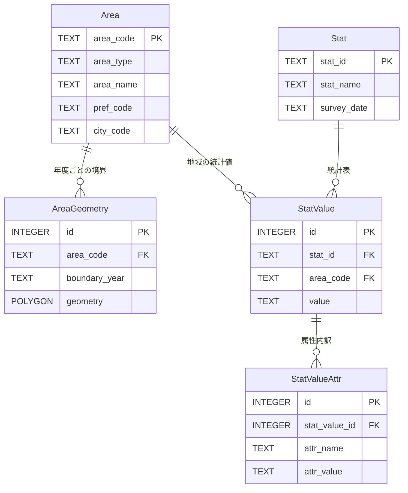
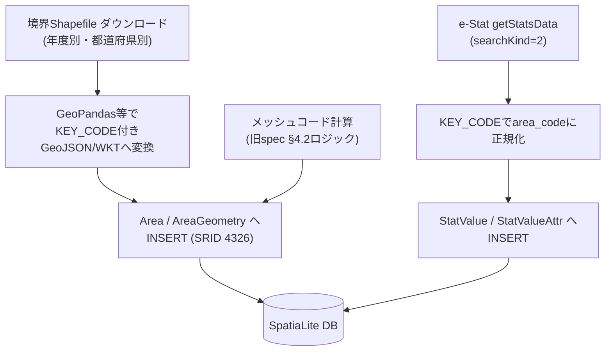

# 未来の店舗生存シミュレーター（仮称）— Design Doc

本ドキュメントは `store-survival-simulator-spec.md`（インセプションデッキ＆PRD）をベースに、実装可否レビューで指摘された以下3点の技術的欠陥を解消し、着手可能な設計へ落とし込んだものである。

1. 町丁目境界ポリゴンの取得パイプラインが未定義だった問題
2. DBスキーマでジオメトリが統計属性ごとに重複し得た正規化不備
3. シミュレーション計算式の未確定パラメータ（α, $C_{senior}$, $Cost_{new}$）

PRD側の目的・ペルソナ・ビジネス価値・NOT List・技術選定（MapLibre/D3.js, FastAPI, SpatiaLite）はそのまま踏襲する。本書はそれを実装可能な形に具体化するものであり、PRDを置き換えるものではない。

---

## 1. データモデル設計（改訂版）

### 1.1 何が問題だったか

旧設計では `MapArea.stat_val_attr_id` が `StatValueAttr`（属性値：性別・年齢階級など）を参照していた。これは「同じ町丁目の境界ポリゴン」が属性値の数だけ重複格納される設計であり、かつ `StatValue` にはそもそも「どの町丁目/メッシュの値か」を示すキーが存在しなかった。

### 1.2 改訂方針

**地域（Area）を独立した第一級エンティティとして切り出し、ジオメトリを属性から完全に分離する。** `StatValue` は `area_code` を直接持ち、どの地域の値かを一意に識別できるようにする。

### 1.3 ER図



### 1.4 テーブル定義

#### 1.4.1 `Area` — 地域マスタ
町丁目・メッシュを問わず、地域そのものを一意に表すマスタ。境界の再編（市町村合併・字の変更）があっても `area_code` は不変のIDとして扱う。

| カラム名 | 型 | キー | 説明 |
| :--- | :--- | :--- | :--- |
| `area_code` | TEXT | PRIMARY KEY | 町丁目=KEY_CODE（国勢調査小地域コード）、メッシュ=メッシュコード |
| `area_type` | TEXT | | `"chome"` \| `"mesh_1km"` \| `"mesh_500m"` |
| `area_name` | TEXT | | 町丁目名（メッシュはNULL可） |
| `pref_code` | TEXT | | 都道府県コード |
| `city_code` | TEXT | | 市区町村コード |

#### 1.4.2 `AreaGeometry` — 境界ポリゴン（年度別）
**ジオメトリを属性から独立させ、`area_code` × `boundary_year` に1レコードのみ持たせる。** 町丁目は行政区画の再編で年度ごとに境界が変わり得るため年度を持つ（メッシュは不変なので `boundary_year` は代表値でよい）。

| カラム名 | 型 | キー | 説明 |
| :--- | :--- | :--- | :--- |
| `id` | INTEGER | PRIMARY KEY (AUTOINCREMENT) | |
| `area_code` | TEXT | FOREIGN KEY (Area.area_code) | |
| `boundary_year` | TEXT | | 境界データの基準年（例: `"2020"`） |
| `geometry` | POLYGON | (SpatiaLite Geometry, SRID 4326) | R-Treeインデックス対象 |

#### 1.4.3 `Stat` — 統計メタデータ（旧spec §3.1を継承、変更なし）

#### 1.4.4 `StatValue` — 統計値（**`area_code` を追加**）

| カラム名 | 型 | キー | 説明 |
| :--- | :--- | :--- | :--- |
| `id` | INTEGER | PRIMARY KEY (AUTOINCREMENT) | |
| `stat_id` | TEXT | FOREIGN KEY (Stat.stat_id) | |
| `area_code` | TEXT | FOREIGN KEY (Area.area_code) | **新規**：どの地域の値かを一意に示す |
| `value` | TEXT | | 人口数・世帯数・事業所数など |

#### 1.4.5 `StatValueAttr`（旧spec §3.3を継承。`stat_value_id` 経由でのみ地域と間接的に紐づき、ジオメトリとは無関係になる）

### 1.5 インデックス方針

```sql
SELECT CreateSpatialIndex('AreaGeometry', 'geometry');
CREATE INDEX idx_statvalue_area_stat ON StatValue(area_code, stat_id);
CREATE INDEX idx_statvalueattr_sv ON StatValueAttr(stat_value_id);
```

商圏抽出クエリ（半径Dkmバッファとの交差判定）は `AreaGeometry` に対して1回のR-Tree検索を行えばよく、属性の数だけ重複したジオメトリをスキャンする無駄がなくなる。

---

## 2. データ取得パイプライン（新規：境界データの扱いを明記）

### 2.1 何が問題だったか

旧spec §4.2のコードは「メッシュコード→座標」の変換のみを示しており、これは **メッシュにしか使えない**。町丁目境界は行政区画の任意形状ポリゴンであり、計算式では導出できない。また `getStatsData`（e-Stat統計値API）は属性データのみを返し、ポリゴン形状を含まない。

### 2.2 データソースの分離

| データ種別 | 取得元 | 形式 | 更新頻度 |
| :--- | :--- | :--- | :--- |
| 統計値（人口・世帯・事業所数） | e-Stat API `getStatsData`（`searchKind=2`） | JSON | 国勢調査=5年、経済センサス=5年 |
| 町丁目境界ポリゴン | e-Stat「地図で見る統計（jSTAT MAP）」/ 政府統計 小地域境界データダウンロード | Shapefile（KEY_CODE付き） | 国勢調査年に合わせて年度別に配布 |
| メッシュ境界ポリゴン | メッシュコードから計算（旧spec §4.2のロジックを流用） | 計算生成 | 不変（メッシュ定義自体は変わらない） |

### 2.3 ETLバッチフロー



1. **境界データ取り込み（町丁目）**: 年度別Shapefileを `ogr2ogr` または GeoPandas + Shapely で読み込み、`KEY_CODE` を `area_code` として `Area` / `AreaGeometry(boundary_year=<年度>)` に格納。
2. **境界データ生成（メッシュ）**: 旧spec §4.2の `meshcode_to_polygon_wkt` をそのまま利用し、`AreaGeometry` に格納（`area_type="mesh_1km"` 等）。
3. **統計値取り込み**: `getStatsData` レスポンスの地域コード（町丁目=KEY_CODE、メッシュ=メッシュコード）を `area_code` としてそのまま `StatValue` に紐づける。境界データと統計値は同じ `area_code` 空間を共有するため突合は単純なキー一致で済む。

### 2.4 座標系についての注意

メッシュコード計算式は度単位の単純な線形計算（JIS X0410近似）であり、境界Shapefile側は通常JGD2011（EPSG:6668、実務上はWGS84/EPSG:4326とほぼ互換）で提供される。両者を同一DB内でSRID 4326として扱うことで実用上の誤差は無視できるレベルに収まる（メートル単位で数cm〜数十cm程度）。将来的に高精度な測地系変換が必要になった場合のみ `pyproj` 等での変換を追加する。

---

## 3. 町丁目・行政区画再編への対応（非機能要件・新規）

町丁目は市町村合併や住居表示変更により、国勢調査の実施年度間で `KEY_CODE` が変わったり、町丁目自体が分割・統合されることがある。

* **方針**: `Area` は年度をまたいだ「概念的な地域」の同一性を保証しない。年度間比較（§5.1のトレンド算出）は、**総務省統計局が国勢調査ごとに公開する「町丁字等別新旧対応表」を用いて年度間のKEY_CODE対応関係をマッピングするテーブル（`AreaCorrespondence`）を別途持つ**ことで対応する。
* 対応表が存在しない（追跡不能な）分割・統合パターンについては、旧年度の値を面積按分で新区画に配分するフォールバックを行い、按分推定である旨をUIに注記する。

```sql
CREATE TABLE AreaCorrespondence (
    id INTEGER PRIMARY KEY AUTOINCREMENT,
    old_area_code TEXT,
    new_area_code TEXT,
    allocation_ratio REAL  -- 面積按分等による人口配分比率（1.0=完全対応）
);
```

---

## 4. シミュレーションモデル計算式（確定版）

旧spec §5で未定義だった $\alpha$、$C_{senior}$、$Cost_{new}$ をエンジニアリング上の仮決定として明記する。**いずれも将来的に実データ・実運用で調整可能なパラメータとして実装し、ハードコードしない。**

### 4.1 $\alpha$（ターゲット自然増減率）— コーホート変化率法

町丁目 $i$ ごとに、直近2回の国勢調査（例：2015年・2020年）から5歳階級のコーホート変化率 $CCR_i$ を算出する。

$$CCR_i = \frac{\text{Pop}_{2020}(i,\ a+5)}{\text{Pop}_{2015}(i,\ a)}$$

（年齢階級 $a$ を5年後の階級 $a+5$ に対応させて追跡する、標準的なコーホート要因法）

主要な対象コーホートについて平均を取り、5年あたりの変化率とする。旧spec式 $H_{future} = H_{now} \times (1+\alpha)^{10}$ の形式を維持するため、年率換算した $\alpha$ を次式で定義する。

$$\alpha_i = CCR_i^{\,1/5} - 1$$

これにより $(1+\alpha_i)^{10} = CCR_i^{\,2}$ となり、5年ごとのコーホート変化を10年（2期分）に複利適用する形になる。

### 4.2 $C_{senior}$（シニア世帯の購買単位額）

初期実装では実データ未整備のため、基準購買単位額 $C$ に対する近似係数として次式を用いる。

$$C_{senior} = C \times 0.7$$

（0.7は仮係数。総務省「家計調査」の高齢無職世帯の平均消費支出構成比を参考にした暫定値であり、設定ファイルで変更可能なパラメータとして実装する。将来的に家計調査の品目別データを取り込み、業態別の実係数に置き換える）

### 4.3 $Cost_{new}$（働き方シフト後の採用コスト）

旧spec は $Cost_{young}$ の式のみ定義され、比較対象の $Cost_{new}$ が欠落していた。採用難易度インデックス $Idx_{hire}$ の改善度に応じて、求人媒体への掲載頻度 $N$ が逓減すると仮定し、以下で定義する。

$$N_{new} = N_{current} \times \min\left(1,\ \frac{Idx_{hire}(W_0)}{Idx_{hire}(W_{new})}\right)$$

$$Cost_{new} = \text{時給}_{標準} \times \text{人数} + N_{new} \times 50,000\text{円}$$

$Idx_{hire}(W_{new}) > Idx_{hire}(W_0)$（採用しやすくなる）であれば $N_{new} < N_{current}$ となり掲載費が逓減する。$\min(1, \cdot)$ で「改善しても現状より頻度が増える」ケースを排除する。

$$\text{削減効果額} = Cost_{young} - Cost_{new}$$

---

## 5. QA検証基準（旧spec §7に追加）

旧spec の4項目（API検証・空間クエリ150ms・描画45FPS・クレジット表示）を継承し、以下を追加する。

5. **境界データ突合検証**: 取り込んだ町丁目境界データの `area_code`（KEY_CODE）と、統計値側の地域コードの一致率が **100%** であること（不一致がある場合はETLログにエラー出力し、当該地域を「データ欠損」として明示的にUI表示する）。
6. **年度またぎトレンド算出検証**: `AreaCorrespondence` を用いた新旧対応が必要な町丁目について、按分推定である旨がUI上に注記されていること。

---

## 6. 未解決事項（Open Questions）

* $C_{senior}$ の0.7係数、$Cost_{new}$ の逓減モデルは暫定値であり、実データ（家計調査ミクロデータ等）が入手でき次第、精緻化が必要。
* e-Stat APIの1日あたりリクエスト上限・スロットリング仕様は公式ドキュメントで別途確認し、バッチ取得のリトライ/バックオフ戦略を実装フェーズで詳細化する。
* 境界Shapefileのライセンス・クレジット表記要件（e-Statクレジットと別に、境界データ自体の利用規約確認が必要か）は要確認。
