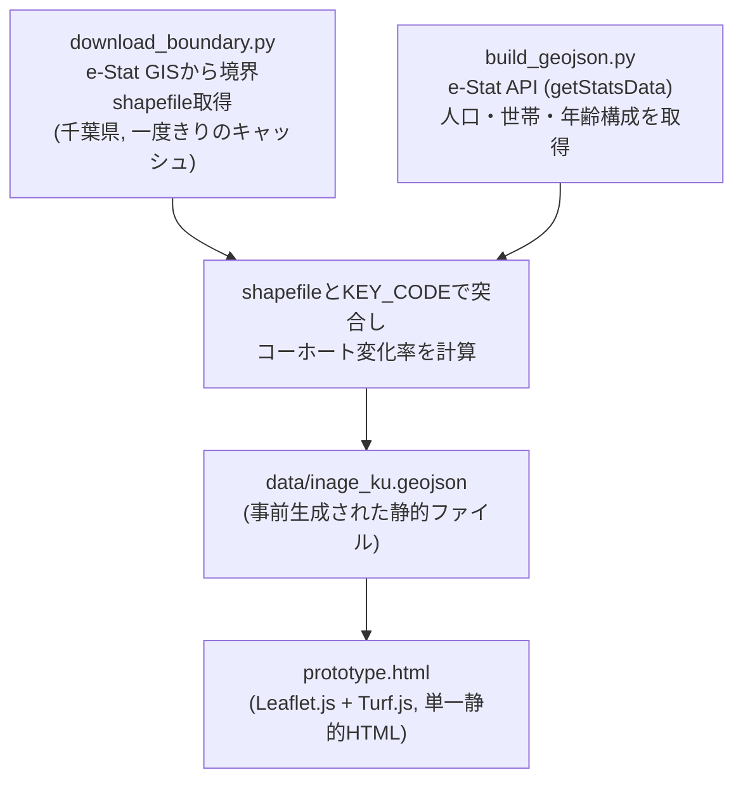

# 未来の店舗生存サバイバルゲーム — Design Doc（実装ベース・改訂版）

> **改訂の経緯**: 本書は当初 `store-survival-simulator-spec.md`（インセプションデッキ＆PRD）を
> ベースに、SpatiaLite + FastAPI + MapLibre/D3.js という技術スタックを前提とした実装設計書
> だった。しかし実際に実装されたプロトタイプ（`prototype.html` / `scripts/`）は、その後の
> `store-survival-game-gdd-v6.md`（GDD v6.1）が示す「円建て財務モデルを持たない定性診断」
> という方向性は踏襲しつつ、GDDが提案したStreamlit/PyDeck/標準SQLiteでもなく、旧spec/design-doc
> が前提としたSpatiaLite/FastAPIでもない、**バックエンド・DBを一切持たない静的サイト構成**に
> 落ち着いた。本書はその**実装の実体**を記述するために全面的に書き直したものであり、旧来の
> SpatiaLiteベース設計はもはや採用されていない（経緯の詳細は `README.md` を参照）。

---

## 1. アーキテクチャ概要

サーバー・データベースは存在しない。データ生成（Pythonスクリプト、オフライン・手動実行）と
閲覧（ブラウザ、静的HTML）が完全に分離しており、`prototype.html` はローカルファイルとして
開くだけで動作する。

---

## 2. データ生成パイプライン（`scripts/`）

### 2.1 `download_boundary.py`
千葉県（`PREF_CODE=12`）の町丁目境界shapefileを e-Stat の統計地図（jSTAT MAP）配信元
（`dlserveyId=A002005212020`, 2020年国勢調査境界, JGD2011）からダウンロードし、
`data/cache/r2ka12/` に展開する。既にダウンロード済みのZIPがあれば再取得しない。

### 2.2 `build_geojson.py`
対象は千葉市稲毛区（`WARD_CODE=12103`）固定。以下のe-Stat統計表を取得する。

| 用途 | 統計表ID |
| :--- | :--- |
| 男女別人口総数・世帯総数（令和2年） | `8003006730` |
| 年齢（5歳階級）別人口（令和2年） | `8003006752` |
| 世帯の家族類型別一般世帯数（令和2年） | `8003006873` |
| 年齢（5歳階級）別人口（平成27年、コーホート変化率算出用） | `8003000081` |

処理の流れ:
1. `getStatsData`（`searchKind=2`）で町丁目レベル（level 2/4）の値を取得。
2. 年齢階級を3区分（`pop_young`=15-24歳, `pop_active`=25-59歳, `pop_senior`=60歳以上＋65歳以上ロールアップ）に集約。
3. 2015年・2020年の同一区分人口から、町丁目ごとの年率変化率を算出:
   $$\text{rate}_b = \left(\frac{\text{Pop}_{2020}(b)}{\text{Pop}_{2015}(b)}\right)^{1/5} - 1$$
   （年齢シフトを追うコーホート要因法ではなく、同一区分同士の単純比較の簡易版）
4. 2015年データが無い／0の町丁目は、区全体の人口加重平均レート（フォールバック）で補完する。
5. shapefileの `KEY_CODE` と統計値の地域コードを突合し、`geometry` + `properties`
   （`population`, `households_total`, `pop_young/active/senior`, `rate_young/active/senior`,
   `family_hh`, `senior_hh` 等）を持つ GeoJSON Feature を組み立てる。
6. `data/inage_ku.geojson` に書き出す。

DBスキーマ（`Area`/`AreaGeometry`/`StatValue` 等）は存在しない。町丁目1件＝GeoJSON Feature
1件がそのまま最終成果物であり、正規化されたリレーショナルモデルは使っていない。

---

## 3. フロントエンド（`prototype.html`）

単一のHTMLファイルで、外部依存はCDN経由の **Leaflet.js 1.9.4** と **Turf.js 6** のみ
（MapLibre/D3.js、Streamlit/PyDeckのいずれも不使用）。

### 3.1 商圏抽出
店舗位置（クリック）を中心に、業種ごとの `radiusDefault`（500m〜3000m）を半径として、
Turf.jsで町丁目ポリゴンとの交差判定を行い、商圏内フィーチャー集合を得る。

### 3.2 業種定義（`BUSINESS_TYPES`）
GDD v6.1と同じ7業種を実装済み（コンビニ／食品スーパー／居酒屋／ドラッグストア／
ペットショップ・サロン／ペット関連小売／金融事業・地域代理店）。各業種は
`weights`（若年/現役/シニアの客層適性重み）、`laborDependency`（依存する労働力層）、
`wasteRiskCoef`（商品ミスマッチ感度）、`radiusDefault` を持つ。**円建ての初期売上・
原価率・人件費率はGDD文書上「参考値」として残っているだけで、コードには一切存在しない。**

### 3.3 戦略適合度診断（`evaluateStrategy()`）
実人口データのみを使い、円換算は行わない。

* **客層マッチ度**: 業種の重み × 商圏内実人口（3区分）を現在・10年後で比較した比率。
* **採用のしやすさ**: 依存する労働力層の人口が10年でどう変わるかの比率
  （`laborPoolAt()`。ヒトコマンド「主婦・シニア短時間シフト」適用時は労働力プールの
  定義を切り替える）。
* **商品ミスマッチ判定**: 高齢化率30%超 かつ 業種が若年/現役寄りの場合にフラグを立てる
  （モノコマンドで解消可能）。
* **判定は3段階**: `ratio >= 1.0` → 良好、`>= 0.8` → 注意、それ未満 → 深刻
  （GDD v6.1の本文が挙げる4段階・閾値1.1/0.9/0.7とは異なる、実装上の簡易版）。

**カネ（財務）コマンドは実装されていない**（GDD v6.1の「一旦削除」方針をそのまま反映）。

### 3.4 未実装のGDD要素
以下はGDD v6が描いていたが、プロトタイプには実装されていない:
* Streamlit + PyDeckによる3D描画、標準SQLite + JISメッシュ座標計算
* 10期（10年間）のP&L推移シミュレーション
* SSS〜Eの生存ランク判定
* ポータブルZIP配布（`起動する.bat` / `run.sh`）

---

## 4. 対応範囲・制約

* 対象エリアは千葉市稲毛区固定（`WARD_CODE`, `PREF_CODE` はスクリプト内ハードコード）。
  他エリア対応にはスクリプトの汎用化が必要。
* 境界データの年度またぎ対応（市町村合併・字の変更によるKEY_CODE不整合）は未対応。
  現状は2020年境界固定・2015年との単純区分比較のみ。
* データ更新は手動実行（`download_boundary.py` → `build_geojson.py`）が前提で、
  自動バッチやCIは組んでいない。

## 5. 未解決事項（Open Questions）

* 町丁目の年度またぎ対応（`AreaCorrespondence` 的な新旧KEY_CODE対応）は必要になった時点で検討。
* 稲毛区以外への展開時、`WARD_CODE`/`PREF_CODE`のハードコードをどう外出しするか。
* GDD v6.1が言及する「実データ化された場合の財務シミュレーション復活」を実装するかどうかは未定。
