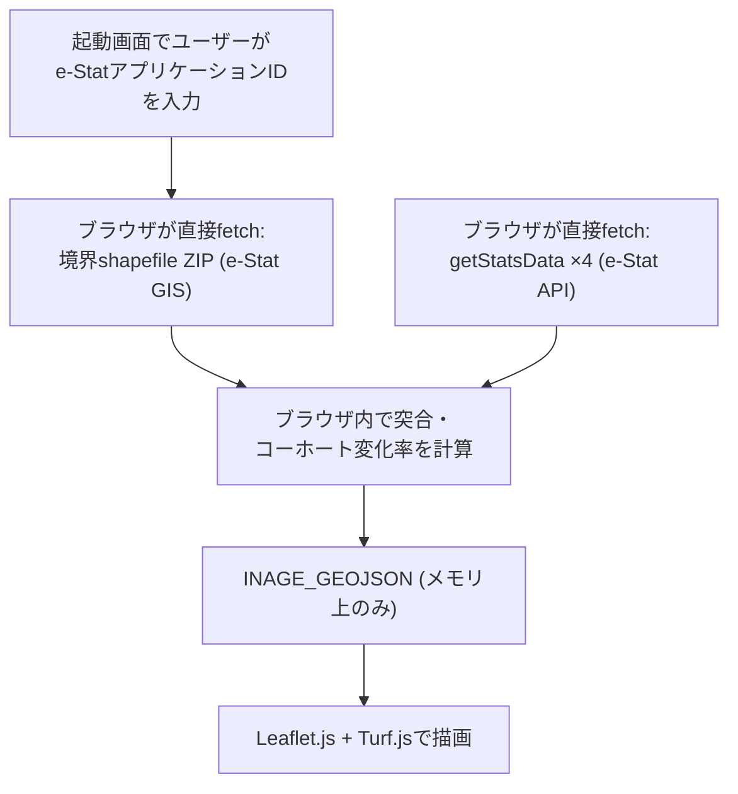

# 未来の店舗生存サバイバルゲーム — Design Doc（実装ベース・改訂版）

> **改訂の経緯**: 本書は当初 `store-survival-simulator-spec.md`（インセプションデッキ＆PRD）を
> ベースに、SpatiaLite + FastAPI + MapLibre/D3.js という技術スタックを前提とした実装設計書
> だった。実装は`store-survival-game-gdd-v6.md`（GDD v6.1）が示す「円建て財務モデルを持たない
> 定性診断」という方向性は踏襲しつつ、GDDが提案したStreamlit/PyDeck/標準SQLiteでもなく、
> 旧spec/design-docが前提としたSpatiaLite/FastAPIでもない、**バックエンド・DBを一切持たない
> 単一HTML構成**に落ち着いた。当初はこのHTMLに事前生成したGeoJSONを静的に埋め込む方式
> だったが、研修配布用途（「HTMLファイル単体で配布し、参加者ごとに自分のe-Stat APIキーで
> データ取得する」）に合わせて、**参加者が入力したAPIキーを使い、ブラウザが起動時に
> e-Statから直接データを取得するライブ取得方式**へ変更した。本書はその最新の実装を
> 記述したものである（経緯の詳細は `README.md` を参照）。

---

## 1. アーキテクチャ概要

サーバー・データベースは存在しない。`prototype.html` はローカルファイルとして開くだけで
動作するが、起動直後の画面でユーザーが**自分自身のe-Stat アプリケーションID（APIキー）**
を入力すると、ブラウザがそのキーを使って直接 e-Stat の各エンドポイントにfetchし、必要な
データをその場で取得する。キーはJS変数として保持されるのみで、`localStorage`等への永続化や
配布ファイルへの埋め込みは行わない。取得したデータもページを閉じれば消える（キャッシュしない）。

> ⚠ **CORS未検証**: `api.e-stat.go.jp` と `www.e-stat.go.jp/gis/statmap-search/data` が
> ブラウザからのクロスオリジンfetchを許可しているかは、開発時点では確認できていない
> （開発環境のネットワークポリシーにより両ホストへの疎通確認自体ができなかった）。
> 研修本番の前に実機ブラウザで必ず検証すること。許可されていない場合、この方式は
> 技術的に成立せず、簡易プロキシサーバーを挟む設計に戻す必要がある。

### 旧・オフライン生成パイプライン（`scripts/`、現在は未使用）
`scripts/download_boundary.py` と `scripts/build_geojson.py` は、ライブ取得方式に切り替える
前に使っていた開発用のオフラインバッチで、e-Stat境界shapefile・統計値を事前取得し
`data/inage_ku.geojson` を1回生成していた。**`prototype.html`は現在これらの出力を読み込まず、
実行時の依存関係もない。** ただしライブ取得ロジック（下記2章）は、このPythonスクリプトの
集計・コーホート変化率計算ロジックをJavaScriptに移植したものであり、参照実装として
残してある。

---

## 2. データ取得ロジック（`prototype.html` 内、`loadRealData()`）

対象は千葉市稲毛区（`WARD_CODE=12103`）固定。ゲーム開始ボタン押下時に、以下を**逐次**fetchする
（並列化していない。理由は`getStatsData`側の同時アクセス数を抑えるため）。

| 用途 | 取得元 | 統計表ID/パラメータ |
| :--- | :--- | :--- |
| 町丁目境界ポリゴン | `www.e-stat.go.jp/gis/statmap-search/data`（`dlserveyId=A002005212020`, 千葉県, JGD2011） | APIキー不要。ZIP(shapefile)をshpjsでGeoJSON化し、`KEY_CODE`が`12103`始まりの地物のみ抽出 |
| 男女別人口総数・世帯総数（令和2年） | `getStatsData` | `8003006730` |
| 年齢（5歳階級）別人口（令和2年） | `getStatsData` | `8003006752` |
| 世帯の家族類型別一般世帯数（令和2年） | `getStatsData` | `8003006873` |
| 年齢（5歳階級）別人口（平成27年、コーホート変化率算出用） | `getStatsData` | `8003000081` |

処理の流れ（`loadRealData()` → 各ヘルパー関数）:
1. `loadBoundaryFeatures()`: 境界ZIPをfetchし、`shp()`(shpjs)でGeoJSONへ変換、稲毛区のみ抽出。
2. `fetchStatsTable()`: `getStatsData`（`searchKind=2`, `cdAreaFrom/cdAreaTo`で稲毛区に絞込）を
   呼び出し、`RESULT.STATUS !== 0`ならAPIキー誤り等としてエラーを投げる。
3. `areaLevels()`: `CLASS_INF.CLASS_OBJ`から町丁目レベル（level 2/4）の地域コードと名称を抽出。
4. 年齢階級を3区分（`pop_young`=15-24歳, `pop_active`=25-59歳, `pop_senior`=60歳以上＋65歳以上
   ロールアップ）に集約。
5. 2015年・2020年の同一区分人口から、町丁目ごとの年率変化率を算出:
   $$\text{rate}_b = \left(\frac{\text{Pop}_{2020}(b)}{\text{Pop}_{2015}(b)}\right)^{1/5} - 1$$
   （年齢シフトを追うコーホート要因法ではなく、同一区分同士の単純比較の簡易版）
6. 2015年データが無い／0の町丁目は、区全体の人口加重平均レート（フォールバック）で補完する。
7. 境界フィーチャーの`KEY_CODE`と統計値の地域コードを突合し、`geometry` + `properties`
   （`population`, `households_total`, `pop_young/active/senior`, `rate_young/active/senior`,
   `family_hh`, `senior_hh` 等）を持つ`INAGE_GEOJSON`（メモリ上のグローバル変数）を組み立てる。

各fetchは`try/catch`で失敗を捕捉し、起動画面に「取得に失敗しました: (理由)」を表示して
再試行できるようにする。DBスキーマは存在せず、町丁目1件＝GeoJSON Feature 1件がそのまま
最終データであり、正規化されたリレーショナルモデルは使っていない。

---

## 3. フロントエンドUI（`prototype.html`）

単一のHTMLファイルで、外部依存はCDN経由の **Leaflet.js 1.9.4**・**Turf.js 6**・
**shpjs 4**（shapefile ZIP → GeoJSON変換）のみ（MapLibre/D3.js、Streamlit/PyDeckのいずれも
不使用）。

### 3.0 起動画面（`#setupScreen`）
ページを開くと最初に表示される画面。ゲームタイトル・概要説明、e-Stat APIキー入力欄
（`type=password`、表示/隠すトグル付き）、開始ボタンのみで構成される。開始ボタン押下で
`loadRealData()`が完了すると`#setupScreen`を隠し、`#gameRoot`（地図・診断UI一式）を表示する
（`rerenderAll()`はこの成功後にのみ呼ばれる。データ未取得の間は空振りするようガードしてある）。

### 3.1 商圏抽出
店舗位置（クリック）を中心に、業種ごとの `radiusDefault`（500m〜3000m）を半径として、
Turf.jsで町丁目ポリゴンとの交差判定を行い、商圏内フィーチャー集合を得る。

### 3.2 業種定義（`BUSINESS_TYPES`）
GDD v6.1と同じ7業種を実装済み（コンビニ／食品スーパー／居酒屋／ドラッグストア／
ペットショップ・サロン／ペット関連小売／金融事業・地域代理店）。各業種は
`weights`（若年/現役/シニアの客層適性重み）、`laborDependency`（依存する労働力層）、
`wasteRiskCoef`（商品ミスマッチ感度）、`radiusDefault` を持つ。**円建ての初期売上・
原価率・人件費率はGDD文書上「参考値」として残っているだけで、コードには一切存在しない。**

### 3.3 戦略適合度診断（`evaluateStrategy()`）
実人口データのみを使い、円換算は行わない。

* **客層マッチ度**: 業種の重み × 商圏内実人口（3区分）を現在・10年後で比較した比率。
* **採用のしやすさ**: 依存する労働力層の人口が10年でどう変わるかの比率
  （`laborPoolAt()`。ヒトコマンド「主婦・シニア短時間シフト」適用時は労働力プールの
  定義を切り替える）。
* **商品ミスマッチ判定**: 高齢化率30%超 かつ 業種が若年/現役寄りの場合にフラグを立てる
  （モノコマンドで解消可能）。
* **判定は3段階**: `ratio >= 1.0` → 良好、`>= 0.8` → 注意、それ未満 → 深刻
  （GDD v6.1の本文が挙げる4段階・閾値1.1/0.9/0.7とは異なる、実装上の簡易版）。

**カネ（財務）コマンドは実装されていない**（GDD v6.1の「一旦削除」方針をそのまま反映）。

### 3.4 未実装のGDD要素
以下はGDD v6が描いていたが、プロトタイプには実装されていない:
* Streamlit + PyDeckによる3D描画、標準SQLite + JISメッシュ座標計算
* 10期（10年間）のP&L推移シミュレーション
* SSS〜Eの生存ランク判定
* ポータブルZIP配布（`起動する.bat` / `run.sh`）

---

## 4. 対応範囲・制約

* 対象エリアは千葉市稲毛区固定（`WARD_CODE`はHTML内にハードコード）。他エリア対応には
  UIでの地域選択とfetchパラメータの汎用化が必要。
* 境界データの年度またぎ対応（市町村合併・字の変更によるKEY_CODE不整合）は未対応。
  現状は2020年境界固定・2015年との単純区分比較のみ。
* 境界shapefileは千葉県全域分をZIPで取得してから稲毛区分だけ抽出しているため、
  参加者ごとに毎回この大きめのダウンロードが発生する（キャッシュしない）。
* データはページ滞在中のみメモリに保持され、リロードすると再取得が必要
  （オフライン再開・キャッシュの仕組みはない）。
* APIキーの検証はe-Stat側のエラーレスポンス（`RESULT.STATUS`）任せで、事前のフォーマット
  チェック等は行っていない。

## 5. 未解決事項（Open Questions）

* **e-Stat API・境界データ配信元のCORS許可状況が未検証。** 開発環境のネットワーク制約により
  確認できなかった最重要の技術リスク。研修本番前に実機ブラウザでの検証が必須。
* shpjsが実際に稲毛区を含む千葉県shapefile ZIPを問題なくパースできるか（ZIP内部構造・
  文字コード・座標系変換）は未検証。
* 町丁目の年度またぎ対応（新旧KEY_CODE対応）は必要になった時点で検討。
* 稲毛区以外への展開時、`WARD_CODE`のハードコードをどう外出しするか。
* GDD v6.1が言及する「実データ化された場合の財務シミュレーション復活」を実装するかどうかは未定。
* 研修中に多数の参加者が同時に千葉県全域shapefileや`getStatsData`を叩くことによる、
  e-Stat側のレート制限・負荷への配慮は未検討。
